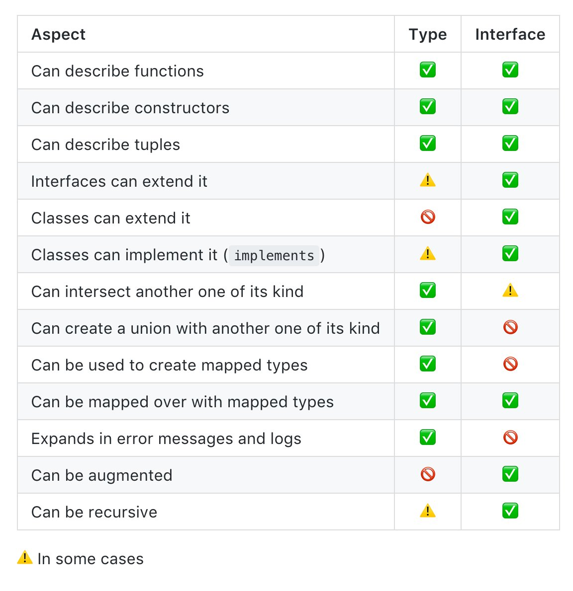
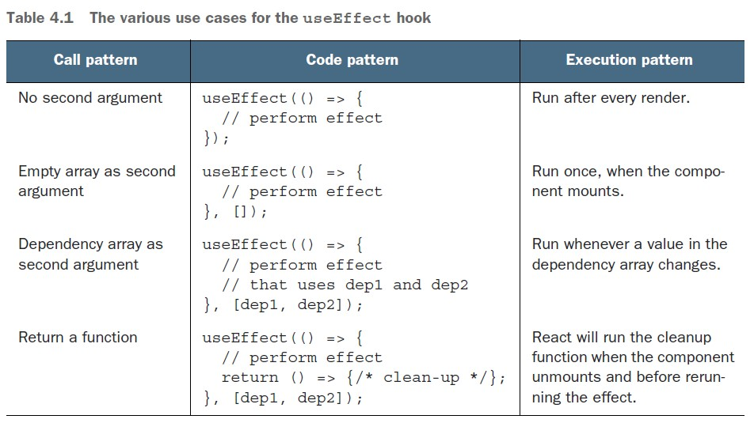

# React.js Basics

- [React.js Basics](#reactjs-basics)
	- [Introducing the function component](#introducing-the-function-component)
		- [Function props](#function-props)
			- [Commonly-Used Props Type](#commonly-used-props-type)
		- [Children prop](#children-prop)
			- [Typing Children](#typing-children)
		- [Parent and child](#parent-and-child)
		- [Writing a function component](#writing-a-function-component)
		- [conditional css classes](#conditional-css-classes)
			- [1. Using Ternary operator](#1-using-ternary-operator)
			- [2. reusable function](#2-reusable-function)
			- [3. Using library](#3-using-library)
	- [Crafting States in functions](#crafting-states-in-functions)
		- [Typing useState](#typing-usestate)
		- [Letting a child drive](#letting-a-child-drive)
		- [Lifting up to the parent](#lifting-up-to-the-parent)
	- [`useEffect` to Handle Side Effects](#useeffect-to-handle-side-effects)
		- [Fetching an API resource](#fetching-an-api-resource)
			- [creating json server](#creating-json-server)
			- [fetching example:](#fetching-example)

## Introducing the function component

A function component with no state, by default, is designed to take the following function
form:

<div align="center">

</div>

### Function props

The input argument of this function is referred to as a `prop`. `Props` take an object format under which we can define any property. Each property is referred to as a `prop`. For
instance, above figure defines a `Title` component with a `text` prop.

The job of a prop, similar to an input argument, is to pass a value to the function. There is also no limitation in terms of the type of prop. Since each prop is a property of an object, it can be a string, a number, an object, a function, an array, or anything that can be assigned using a JavaScript expression, as in the following example:

```tsx
const Title = ({ obj }) => {
 return <h1>{obj.text}</h1>
}
const Title = ({ fn }) => {
 return <h1>{fn()}</h1>
}
```

Once a function component has been defined, it can be used as many times as you want in other places via its instances:

```tsx
const App = () => {
 return <Title text="Hello World" />
}
```

Full example:

```tsx
type GreetingProps = {
 name: string;
};

const Greeting = (props: GreetingProps) => {
 return (
  <>
   <div className='h-screen flex justify-center items-center'>
    <h1 className='text-3xl font-bold'>Hello {props.name}!</h1>
   </div>
  </>
 );
};

const App = () => <Greeting name='Steve' />;

export default App;
```

#### Commonly-Used Props Type

`Type Vs Interface`

<div align="center">

</div>

Let's take a moment to look at some of the types that go along with some of the more common props that we tend to see in React applications.

For starters, we have our basic primitives.

```tsx
type CounterProps = {
  incident: string;
  count: number;
  enabled: boolean;
};
```

We can also have arrays or collections of primitives.

```tsx
type GroceryListProps = {
  items: string[];
};
```

Sometimes, we don't want to allow any string—only certain strings. We can use a `union` type to represent this.

```tsx
type GroceryListProps = {
  items: string[];
  status: "loading" | "error" | "success";
};
```

It's not uncommon for us to find ourselves using objects in JavaScript (erm, TypeScript). So, what would that look like?

```tsx
type ContrivedExampleComponmentProps = {
  anObject: object; // Useful as a placeholder.
  anotherObject: {}; // Can have any properties and values.
  item: {
    id: string;
    title: string;
  };
  items: {
    id: string;
    title: string;
  }[]; // An array of objects of a certain shape.
};
```

We could refactor this a bit.

```tsx
type Item = {
  id: string;
  title: string;
};

type ContrivedExampleComponmentProps = {
  item: Item;
  items: Item[];
};
```

So, if you look at our two object examples above, we're missing something.

`{}` will allow for an object with any keys and any values.
`{ id: string; title: string; }` will only allow for an object with two keys: `id` and `title` as long as those values are both strings.

But, what if we wanted to find a happy medium? What if we wanted a situation where we said, "Listen, the key can be any string and the value has to be of a certain type.

That might look something like this:

```tsx
type ItemHash = {
  [key: string]: Item;
};
```

Or, if we wanted to say the keys are number and the values are strings, it would look like this:

```tsx
type Dictionary = {
  [key: number]: string;
};
```

Another way of writing either of those would be as follows:

```tsx
Record<string, Item>
Record<number, string>
```

I prefer the first syntax, personally. But, this is your life. You do what you want.

Okay, so we tend to also pass functions around, right? What does that look like?

```tsx
type ContrivedExampleProps = {
  // Does not take any arguments. Does not return anything.
  onHover: () => void;
  // Takes a number. Returns nothing (e.g. undefined).
  onChange: (id: number) => void;
  // Takes an event that is based on clicking on a button.
  // Returns nothing.
  onClick(event: React.MouseEvent<HTMLButtonElement>): void;
};
```

Finally, we should consider the fact that not every prop is required.

```tsx
type ContrivedProps = {
  requiredProp: boolean;
  optionalProp?: string;
};
```

### Children prop

All the props of a function component should be defined explicitly, just like input arguments. But, there's a prop worth knowing early on that isn't apparent to follow this
rule. This is called a children prop:

```tsx
const App = () => <Greeting>Hello World</Greeting>;
```

You might be using the preceding code without knowing how exactly the "Hello World" string is put under the `Greeting` component. Interestingly, the string is wired to the component via a `children` prop. This will become clear when we get to the definition of the `Greeting` component:

```tsx
const Greeting = ({ children }) => {
 return <h1>{children}</h1>
}
```

#### Typing Children

How do we type this? Well. We have a few choices.

- `JSX.Element;:` 💩 This doesn't account for arrays at all.
- `JSX.Element | JSX.Element[]` ;😕 This doesn't accept strings.
- `React.ReactChildren;`: 🤪 Not at even an appropriate type; it's a utility function.
- `React.ReactChild[];`: 😀 Accepts multiple children, but it doesn't accept a single child.
- `React.ReactNode;`: 🏆 Accepts everything.

Example:

```tsx
import React from 'react';
type ChildProp = {
 children: React.ReactNode;
};

const Box = ({ children }: ChildProp) => {
 return <section style={{ padding: '1em', border: '5px solid purple' }}>{children}</section>;
};

const App = () => {
 return (
  <Box>
   Just a string.
   <p>Some HTML that is not nested.</p>
   <Box>
    <h2>Another React component with one child.</h2>
   </Box>
   <Box>
    <h2>A nested React component with two children.</h2>
    <p>The second child.</p>
   </Box>
  </Box>
 );
};

export default App;
```

### Parent and child

In React, props are the mechanism for components talking to one another. We can generalize this idea by using two components normally involved in the communication to
a parent and a child, as we have already seen in the previous section.

```tsx
type ChildProp = { text: string;};

const Child = ({ text }: ChildProp) => {
 return <p>Message From Parent: {text}</p>;
};

const Parent = () => {
 const fromParent = 'Hi I"m your parent';
 return <Child text={fromParent} />;
};
```

Once a piece of info gets into a component, the prop binds its value to a local scope variable. From then on, it's the child's job to continue managing its local variable. It can be used pretty flexibly with one limitation. It's not expected to be changed! Or, if you ever change it, the change would not be reflected in the parent component. This behavior is the same as how we use a function with input arguments and its inner scope. The information passing is a one-way ticket.

So now comes a big question. **What if we want to reflect the change to a parent component done by a child component?** How can a one-way ticket get us the information back? This is also done through a prop. As I mentioned, a prop can take any format, hence we can use a function prop:

```tsx
type ChildProp = {
 notifyParent: (text: string) => void;
};

const Child = ({ notifyParent }: ChildProp) => {
 const onChange = () => {
  const text = 'message from child';
  notifyParent(text);
 };
 return <button onClick={onChange}>Click me</button>;
};
const Parent = () => {
 const notifyParent = (textFromChild: string) => {
  console.log(`child notify me ${textFromChild}`);
 };
 return <Child notifyParent={notifyParent} />;
};
```

In the preceding code, we sent a function defined in `Parent` through a `notifyParent` prop. Inside the `Child` component, when a user starts click the button, it fires an `onClick` event where we can invoke the `notifyParent` function.

Essentially, this technique is what we refer to as a `callback` in JavaScript. The parent provides a mechanism to notify that something has changed using a `callback` function. Once the callback function is created, it can be sent to any child to gain the ability of
notification to the parent.

In a typical parent/child relationship in React, it's recommended that **a prop value should not be changed by the child**. Instead, it should be done through a function prop. When comparing React to other libraries, a "one-way" ticket is what we use to refer to this behavior. In the React community, we rarely use this word because this is the behavior designed at its birth.

### Writing a function component

The function, representing a component, defines what to update on the screen. It returns a value composed of some HTML-like code. You should be quite familiar with elements such as `<ul>` and `<li>`; React also allows the addition of JavaScript expressions under these elements. When used together, it requires the JavaScript expression to be wrapped in a pair of brackets, `{}`. The job of this expression is to provide dynamic HTML content.

For instance, if we have a text variable and would like to display it, we could do the following:

```tsx
const Title = () => {
 const text = "Hello World1"
 return <h1>{text}</h1>
}
```

Or, if the text is returned from a function, we can do the following:

```tsx
const Title = () => {
 const fn = () => "Hello World"
 return <h1>{fn()}</h1>
}
```

We know that this JavaScript expression is filled in the location where the `children` prop is.

The children element does not have to be a single element; it can be an array of elements as well:

```tsx
const ListComponent = () => {
 const arr = ['Apple', 'Orange'];
 return (
  <ul>
   {arr.map((v) => (
    <li>{v}</li>
   ))}
  </ul>
 );
};
```

It seems a bit complicated in the preceding code, so let's take a look at what the code tries
to achieve by looking at the result first:

```tsx
return (
<ul>
 {[<li>Apple</li>, <li>Orange</li>]}
</ul>
)
```

Basically, it wants to output two `li` elements. To get there, we create an array containing two elements with a JavaScript expression. Once it becomes a JavaScript expression wrapped in brackets, `{}`, anything in JavaScript can be refactored and programmed however we want. We can use `arr.map` to form this array:

```tsx
{
 ['Apple', 'Orange'].map(v =><li>{v}</li>)
}
```

### conditional css classes

#### 1. Using Ternary operator

```tsx
const NavItem = ({ label, active, disabled, onClick }: NavItemType) => {
 return (
  <li className={`text-xl ${active ? 'font-bold' : ''} ${disabled && 'text-gray-500'}`}>
   <button disabled={disabled} onClick={onClick}>
    {label}
   </button>
  </li>
 );
};
```

#### 2. reusable function

```typescript
const mergeClassNames = (...args: any[]): string =>
 args.filter((arg) => typeof arg === 'string').join(' ');
 //  return args.filter(Boolean).join(' ');

```

```typescript
const NavItem = ({ label, active, disabled, onClick }: NavItemType) => {
 return (
  <li
   className={mergeClassNames(
    'text-xl',
    active && 'font-bold border-b-4 border-black',
    disabled && 'text-gray-400'
   )}>
   <button disabled={disabled} onClick={onClick}>
    {label}
   </button>
  </li>
 );
};
```

Could have defined the function easily as 👍

```typescript
const mergeClassNames = (...args: string[]): string =>
 args.join(' ');
```

But this won't allow `active && 'font-bold border-b-4 border-black'` this boolean expression to work in typescript.

#### 3. Using library

- `classnames` (729 bytes)
- `clsx` ( 516 bytes)
- `merge-class-names` (372 bytes)

```tsx
const NavItem = ({ label, active, disabled, onClick }: NavItemType) => {
 return (
  <li
   className={classnames(
    'text-xl',
    active && ' font-bold border-b-4 border-black',
    disabled && 'text-gray-400'
   )}>
   <button disabled={disabled} onClick={onClick}>
    {label}
   </button>
  </li>
 );
};
```

## Crafting States in functions

### Typing useState

```tsx
const [state, setState] = useState<type>(initialValue);
// Setting State without a Default Value
const [state, setState] = React.useState<type | null>(null);
//undefined
const [state, setState] = React.useState<type | undefined>(undefined);
const [state, setState] = React.useState<type | null | undefined>(undefined);
```

### Letting a child drive

It's very common to send a dispatch function from a parent component to a child component and expect the child to request the state change from the parent:

```tsx
const App = () => {
 const [count, setCount] = useState(0);
 const onClick = () => {
  console.log('clicked', count);
  setCount(count + 1);
 };
 console.log('rendered', count);
 return <Title onClick={onClick} />;
};
const Title = ({ onClick }: TitleT) => {
 return <button onClick={onClick}>+</button>;
};

export default App;
```

### Lifting up to the parent

Due to its design, React doesn't allow information to be sent to an element directly. Instead, the required mechanism is to use a prop that passes the information from a parent to a child, then to a child's child, and so on.

In another way, to share information between two children, the information needs to be available to the parent first before sending it to each of the children:

```tsx

const App = () => {
 const [count, setCount] = useState(0);
 const onClick = () => {
  setCount(count + 1);
 };
 return (
  <>
   <Title onClick={onClick} />
   <Content count={count} />
  </>
 );
};
const Title = ({ onClick }: TitleT) => {
 return <button onClick={onClick}>+</button>;
};
const Content = ({ count }: { count: number }) => {
 return <div>{count}</div>;
};
export default App;
```

## `useEffect` to Handle Side Effects

<div align="center">

</div>

Let's say that we want to know the current browser window size at runtime so that a
greeting title can fit perfectly onto the screen

<div align="center">

</div>

The useEffect hook is a good fit here. After the component is mounted, we can listen for a resize event provided by the `window` object. Once it starts to listen to the event, every time the window resizes, it kicks off a `handleResize` function that sets the width state to the new window size. We also invoke `handleResize` at the mount to get the initial window size.

```tsx
const Greeting = () => {
 const [width, setWidth] = useState(0);
 useEffect(() => {
  function handleResize() {
   setWidth(window.innerWidth);
  }
  window.addEventListener('resize', handleResize);
  handleResize();
  return () => {
   window.removeEventListener('resize', handleResize);
  };
 }, [setWidth]);

 return (
  <h1 className=' h-screen flex justify-center items-center text-3xl'>
   {width > 600 ? 'Hello World' : 'Hello'}
  </h1>
 );
};
```

In order to prevent a memory leak, we return a destroy function from the useEffect callback where the registered event listener is removed when the component is unmounted.

There's a subtle detail to be aware of here – the dependency array has `setWidth` in it because we reference setWidth inside the useEffect function. We know the setWidth function instance doesn't get changed after the mount, so actually, `[setWidth]` can be optional here. But React insists that we add this because when setWidth changes, the effect needs to be re-created.

### Fetching an API resource

#### creating json server

- [https://github.com/typicode/json-server](https://github.com/typicode/json-server)

`data/db.json`:

```json
{
 "items": [
  {
   "id": 1,
   "checked": false,
   "text": "Learn React"
  },
  {
   "id": 2,
   "checked": false,
   "text": "Learn TypeScript"
  }
 ]
}
```

```bash
npx json-server -p 3500 -w data/db.json --delay 2000
curl http://localhost:3500/items
```

#### fetching example:

```tsx
import { useEffect, useState } from 'react';
type Item = {
 id: number;
 checked: boolean;
 text: string;
};
const TodoList = () => {
 const APP_URL = 'http://localhost:3500/items';
 const [error, setError] = useState<string | null>(null);
 const [isLoading, setIsLoading] = useState<boolean>(true);

 const [items, setItems] = useState<Item[]>([]);
 useEffect(() => {
	const fetchItems = async () => {
	try {
		const response = await fetch(APP_URL);
		const data = await response.json();
		console.log(data);
		setItems(data);
		setIsLoading(false);
	} catch (error) {
		setError((error as Error).message);
		setIsLoading(false);
	}
	};
	fetchItems();

// 	  (async () => await fetchItems())();

//   setTimeout(() => {
//    (async () => await fetchItems())();
//   }, 2000);
 }, []);

 return (
  <ul>
   {error && <li>{error}</li>}
   {isLoading && <li>Loading...</li>}
   {!isLoading && !error && items && items.map((item) => <li key={item.id}>{item.text}</li>)}
  </ul>
 );
};
```
