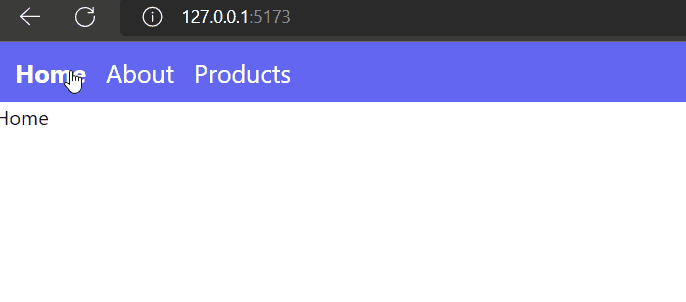
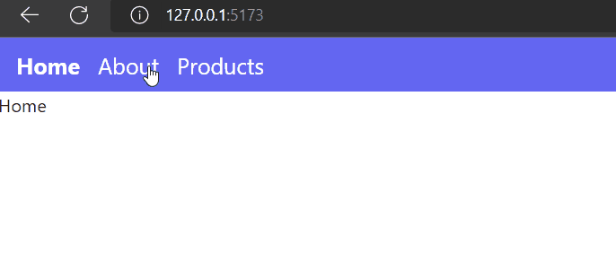
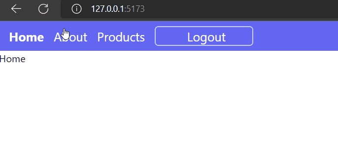

# React Router

- [React Router](#react-router)
  - [Installation](#installation)
  - [resources](#resources)
  - [Configuring The Router](#configuring-the-router)
  - [Defining Routes](#defining-routes)
  - [Handling Navigation:`Link`](#handling-navigationlink)
    - [`NavLink` for styling active links](#navlink-for-styling-active-links)
  - [Dynamic Routing](#dynamic-routing)
    - [Routing Priority and 404 Found Page](#routing-priority-and-404-found-page)
  - [Nested Routes](#nested-routes)
    - [Shared Layouts and `Outlet` Context](#shared-layouts-and-outlet-context)
  - [Manual Navigation](#manual-navigation)
    - [Navigate Component](#navigate-component)
    - [`useNavigation` Hook](#usenavigation-hook)
  - [Navigation Data](#navigation-data)
    - [Search Parameters](#search-parameters)
    - [`State/Location` Data](#statelocation-data)
  - [Protected Routes using `Outlet` and `Navigate`](#protected-routes-using-outlet-and-navigate)

## Installation

- [https://reactrouter.com/en/main](https://reactrouter.com/en/main)

```bash
yarn add react-router-dom
```

## resources

- [https://reactrouter.com](https://reactrouter.com/en/main)
- [https://blog.webdevsimplified.com/2022-07/react-router/](https://blog.webdevsimplified.com/2022-07/react-router/)

## Configuring The Router

`index.tsx/main.tsx`

```tsx
import React from 'react';
import ReactDOM from 'react-dom/client';
import App from './App';
import './index.css';
import { BrowserRouter } from 'react-router-dom';

ReactDOM.createRoot(document.getElementById('root') as HTMLElement).render(
 // <React.StrictMode>
 <BrowserRouter>
  <App />
 </BrowserRouter>
 // </React.StrictMode>
);
```

## Defining Routes

The next step in React Router is to define your routes. This is generally done at the top level of your application, such as in the `App` component, but can be done anywhere you want.

```tsx
import { Route, Routes } from 'react-router-dom';
import About from './pages/About';
import Home from './pages/Home';
import Products from './pages/Products';

const App = () => {
 return (
  <Routes>
   <Route path='/' element={<Home />} />
   <Route path='/about' element={<About />} />
   <Route path='products' element={<Products />} />
  </Routes>
 );
};
export default App;
```

## Handling Navigation:`Link`

Normally in an application you would navigate with `anchor` tags, but React Router uses its own custom `Link` component to handle navigation. This Link component is just a wrapper around an anchor tag that helps ensure all the routing and conditional re-rendering is handled properly so you can use it just like your would a normal anchor tag.

```tsx
const SharedNavLayout = () => {
 return (
  <nav className='h-10 w-full bg-indigo-500'>
   <ul className='flex space-x-4 h-full items-center pl-4 text-xl text-white'>
    <li>
     <Nav to='/'>Home</Nav>
    </li>
    <li>
     <Link to='/about'>About</Link>
    </li>
    <li>
     <Link to='/products'>Products</Link>
    </li>
   </ul>
  </nav>
 );
};

const App = () => {
 return (
  <div className='h-screen w-full'>
   <SharedNavLayout />
   <Routes>
    <Route path='/' element={<Home />} />
    <Route path='/about' element={<About />} />
    <Route path='products' element={<Products />} />
   </Routes>
  </div>
 );
};
export default App;
```

In our example we added two links to the `Home`,`About` and `Products` page. You will also notice that we used the to prop `to` set the URL instead of the `href` prop you are used to using with an anchor tag.

Another thing to note is that the nav we are rending at the top of our page using `SharedNavLayout` component is outside of our `Routes` component which means when we change pages this nav section will not be re-rendered as only the content in the Rou`tes component will change when the URL changes.

### `NavLink` for styling active links

```tsx
const SharedNavLayout = () => {
 return (
  <nav className='h-12 w-full bg-indigo-500'>
   <ul className='flex space-x-4 h-full items-center pl-4 text-xl text-white'>
    <li>
     <NavLink to='/' className={({ isActive }) => (isActive ? 'font-bold' : '')} end>
      Home
     </NavLink>
    </li>
    <li>
     <NavLink to='/about' className={({ isActive }) => (isActive ? 'font-bold' : '')} end>
      About
     </NavLink>
    </li>
    <li>
     <NavLink
      to='/products'
      className={({ isActive }) => (isActive ? 'font-bold' : '')}
      end>
      Products
     </NavLink>
    </li>
   </ul>
  </nav>
 );
};
```

If the `end` prop is used, it will ensure this component isn't matched as "active" when its descendant paths are matched.

## Dynamic Routing

The simplest and most common advanced feature in React Router is handling dynamic routes. In our example, let's assume that we want to render out a component for individual products in our application. We could hardcode each of those routes, but if we have hundreds of products or the ability for users to create products then it is impossible to hardcode all these routes. Instead we need a dynamic route.

```tsx
<Routes>
 <Route path='/' element={<Home />} />
 <Route path='/about' element={<About />} />
 <Route path='products' element={<Products />} />
 <Route path='products/:productID' element={<SingleProduct />} />
</Routes>
```

The final route in the above example is a dynamic route that has a dynamic parameter of `:productID`. In our case our dynamic route will match any URL that starts with `/products` and ends with some value. For example, `/products/1,` `/products/bookName`, and `/products/literally-anything` will all match our dynamic route.

Pretty much always when you have a dynamic route like this you want to access the dynamic value in your custom component which is where the useParams hook comes in.

```tsx
import { useParams } from 'react-router-dom';
const SingleProduct = () => {
 const { productID } = useParams();
 return (
  <div>
   <p>Product: {productID}</p>
  </div>
 );
};
```

The `useParams` hook takes no parameters and will return an object with keys that match the dynamic parameters in your route. In our case our dynamic parameter is `:productID` so the useParams hook will return an object that has a key of `productID` and the value of that key will be the actual `productID` in our URL. For example, if our URL was `/products/3` our page would render Product 3.

Example:

<div align="center">

</div>

```tsx
import data from '../data.json';
const Products = () => {
 return (
  <div>
   <ul>
    {data.products.map((product: Product) => (
     <li key={product.id}>
      <Link to={`/products/${product.id}`} className='underline'>
       {product.name}
      </Link>
     </li>
    ))}
   </ul>
  </div>
 );
};

const SingleProduct = () => {
 const { productID } = useParams();
 // console.log(productID);

 const [product, setProduct] = useState<Product | null>(null);

 useEffect(() => {
  if (productID) {
   const product = data.products.find(
    (product: Product) => product.id === parseInt(productID)
   );
   if (!product) return;
   setProduct(product);
  }
 }, []);

 return (
  <div>
   {product && <p>{product.name}</p>}
   {!product && <p>Product not found</p>}
   <Link to='/products' className='underline'>
    Back to products
   </Link>
  </div>
 );
};
```

### Routing Priority and 404 Found Page

When we were just dealing with hard coded routes it was pretty easy to know which route would be rendered, but when dealing with dynamic routes it can be a bit more complicated. Take these routes for example.

```tsx
<Routes>
 <Route path='/' element={<Home />} />
 <Route path='/about' element={<About />} />
 <Route path='/products' element={<Products />} />
 <Route path='/products/:productID' element={<SingleProduct />} />
 <Route path='/products/new' element={<NewProduct />} />
</Routes>
```

If we have the URL `/products/new` which route would this match? Technically, we have two routes that match. Both `/products/:productID` and `/products/new` will match since the dynamic route will just assume that new is the :id portion of the URL so React Router needs another way to determine which route to render.

In older versions of React Router whichever route was defined first would be the one that is rendered so in our case the `/products/:productID` route would be rendered which is obviously not what we want. Luckily, version 6 of React Router changed this so now React Router will use an algorithm to determine which route is most likely the one you want. In our case we obviously want to render the `/products/new` route so React Router will select that route for us. The actual way this algorithm works is very similar to CSS specificity since it will try to determine which route that matches our URL is the most specific (has the least amount of dynamic elements) and it will select that route.

While we are on the topic of routing priority I also want to talk about how to create a route that matches anything.

```tsx
<Routes>
  <Route path="/" element={<Home />} />
  <Route path="/products" element={<Products />} />
  <Route path="/products/:productID" element={<SingleProduct />} />
  <Route path="/products/new" element={<NewProduct />} />
  <Route path="*" element={<NotFound />} />
</Routes>
```

A `*` will match anything at all which makes it perfect for things like a 404 page. A route that contains a `*` will also be less specific than anything else so you will never accidentally match a * route when another route would have also matched.

## Nested Routes

Finally, we have come to my favorite part of React Router which is how they handle route nesting. In the above example we have three routes that start with `/products` so we can nest those routes inside of each other to clean up our routes.

```tsx
<Routes>
  <Route path="/" element={<Home />} />
  <Route path="/products">
		<Route index element={<Products />} />
		<Route path=":productID" element={<SingleProduct />} />
		<Route path="new" element={<NewProduct />} />
  </Route>
  <Route path="*" element={<NotFound />} />
</Routes>
```

This nesting is pretty simple to do. All you need to do is make a parent `Route` that has the `path` prop set to the shared path for all your child `Route` components. Then inside the parent `Route` you can put all the child `Route` components. The only difference is that the `path` prop of the child `Route` components no longer includes the shared `/products` route. Also, the route for `/products` is replaced with a `Route` component that has no `path` prop, but instead has an `index` prop. All this is saying is that the path of the index `Route` is the same as the parent `Route`.

Now if this is all you could do with nested routes it would be only marginally useful, but the true power of nested routes comes in how it handles **shared layouts**.

### Shared Layouts and `Outlet` Context

<div align="center">

</div>

If you pass an `element` prop to a **parent** route it will render that component for every single **child** Route which means you can put a shared nav or other shared components on every child page with ease.

```tsx
const App = () => {
	return (
		<Routes>
			<Route path='/' element={<SharedNavLayout />}>
				<Route index element={<Home />} />
				<Route path='about' element={<About />} />

				<Route path='products' element={<ProductSharedLayout />}>
					<Route index element={<Products />} />
					<Route path=':productID' element={<SingleProduct />} />
					<Route path='new' element={<NewProduct/>} />
				</Route>

				<Route path='*' element={<div>Not Found</div>} />
			</Route>
		</Routes>
	);
};
```

Here `SharedNavLayout` component will be rendered for every single child route. And rhe `ProductSharedLayout` component will only be rendered for the child routes that are nested inside of it i.e `Products` , `SingleProduct` and `NewProduct`.

Both `SharedNavLayout` and `ProductSharedLayout` work as a placeholder for the actual content of the child route. This is where the `Outlet` component comes in. The `Outlet` component is a placeholder for the actual content of the route. So if we want to render the actual content of the route we just need to put the `Outlet` component inside of the shared layout component.

```tsx
const SharedNavLayout = () => {
	const { id } = useParams();
	return (
		<div className='h-screen w-full'>
			<nav className='h-12 w-full bg-indigo-500'>
				{/*Nav links..........*/}
			</nav>
			<Outlet />
			{/* Placeholder like the {children prop}. This is where the child routes will be rendered */}
		</div>
	);
};

const ProductSharedLayout = () => {
	return (
		<div className='h-screen w-full'>
			<nav className='h-12 w-full bg-indigo-500'>
				<input
					type='text'
					placeholder='Search'
					className='h-8 w-64 rounded-md border-2 border-gray-200 pl-2'
				/>
			</nav>
			<Outlet />
			{/* Placeholder like the {children prop}. This is where the child routes will be rendered */}
		</div>
	);
};
```

## Manual Navigation

- `useNavigate` hook
- `<Navigate />` component

### Navigate Component

The Navigate component is a really simple component that when rendered will automatically redirect the user to the to prop of the Navigate component.


```tsx
<Navigate to="/" />
```

The `Navigate` component shares all the props of the `Link` component so you can pass it the `to`, `replace`, and `state` props. This component is not really something I use much as more often than not I want to redirect a user based on some form of interaction like a form submission.

### `useNavigation` Hook

The useNavigation hook on the other hand is a hook I use all the time. This hook is a really simple hook that takes no parameters and returns a single navigate function which you can use to redirect a user to specific pages. This navigate function takes two parameters. The first parameter is the to location you want to redirect the user to and the second parameter is an object that can have keys for replace, and state.

```tsx
const navigate = useNavigate()

function onSubmit() {
  // Submit form results
  navigate("/books", { replace: true, state: { bookName: "Fake Title" }})
}
```

The above code will redirect the user to the /books route. It will also replace the current route in history and pass along some state information as well.

Another way you can use the navigate function is to pass it a number. This will allow you to simulate hitting the forward/back button.

```tsx
navigate(-1) // Go back one page in history
navigate(-3) // Go back three pages in history
navigate(1) // Go forward one page in history
```

## Navigation Data

### Search Parameters

Search parameters are all of the parameters that come after the ? in a URL (`/products?product=iPhone&minPrice=1000&maxPrice=1500`). In order to work with search parameters you need to use the `useSearchParams` hook.

```tsx
const Products = () => {
	const [searchParams, setSearchParams] = useSearchParams();
	const productName = searchParams.get('product');
	const minPrice = searchParams.get('minPrice');
	const maxPrice = searchParams.get('maxPrice');

	console.log(productName, minPrice, maxPrice);

	return (
		<div>

		</div>
	);
};

export default Products;
```

### `State/Location` Data

The final type of data you can store is `state` and `location` data. This information is all accessible via the useLocation hook. Using this hook is very simple as it returns one value and takes no parameters.

```typescript
const location = useLocation()
```

If we have the following URL `http://localhost/books?n=32#id` then the return value of useLocation would look like this.

```bash
{
  pathname: "/books",
  search: "?n=32",
  hash: "#id",
  key: "2JH3G3S",
  state: null
}
```


This `location` object contains all the information related to our URL. It also contains a unique key that you can use to do caching if you want to cache information for when a user clicks the back button to come back to a page. You also will notice that we have a state property being returned from useLocation as well. This state data can be anything and is passed between pages without being stored in the URL. For example if you click on a Link that looks like this:


```tsx
<Link to="/books" state={{ name: "Kyle" }}>
```

then the state value in the location object will be set to `{ name: "Kyle" }`.

This can be really useful if for example you wan to send across simple messages between pages that shouldn't be stored in the URL. A good example of this would be something like a success message that gets sent to the page you are redirected to after creating a new book.

## Protected Routes using `Outlet` and `Navigate`

<div align="center">

</div>

Protected route can be defined using Nested Route logic.

```tsx
const App = () => {
	return (
		<AuthProvider>
			<Routes>
				{/* Protected Route: Only logged in users can access this route*/}
				<Route path='/' element={<ProtectedRoute />}>
					<Route path='/' element={<SharedNavLayout />}>
						<Route index element={<Home />} />
						<Route path='about' element={<About />} />
						<Route path='products' element={<ProductSharedLayout />}>
							<Route index element={<Products />} />
							<Route path=':productID' element={<SingleProduct />} />
							<Route path='new' element={<div>Create New</div>} />
						</Route>
					</Route>
				</Route>
				{/* Public Route */}
				<Route path='login' element={<Login />} />
				<Route path='*' element={<div>Not Found</div>} />
			</Routes>
		</AuthProvider>
	);
};
export default App;
```

`ProtectedRoute` component

```tsx
import { Navigate, Outlet } from 'react-router-dom';
import { useAuth } from '../App';

const ProtectedRoute = () => {
	const { isLogged, Login } = useAuth();

	return isLogged ? <Outlet /> : <Navigate to='/login' />;
};

export default ProtectedRoute;
```

`AuthProvider` component

```tsx
type ContextType = {
	isLogged: boolean;
	Logout: () => void;
	Login: () => void;
};

type FC = {
	children: React.ReactNode;
};

const AuthContext = createContext<ContextType>({} as ContextType);
const AuthProvider = ({ children }: FC) => {
	const [isLogged, setIsLogged] = useState(false);
	return (
		<AuthContext.Provider
			value={{
				isLogged: isLogged,
				Logout: () => setIsLogged(false),
				Login: () => setIsLogged(true)
			}}>
			{children}
		</AuthContext.Provider>
	);
};
```

`Login` component

```tsx
import React, { useEffect, useState } from 'react';
import { useNavigate } from 'react-router-dom';
import { useAuth } from '../App';

const Login = () => {
	const navigate = useNavigate();

	const { isLogged, Login } = useAuth();

	useEffect(() => {
		if (isLogged) {
			navigate('/');
		}
	}, [isLogged]);

	const [email, setEmail] = useState<string>('');
	const [password, setPassword] = useState<string>('');
	const handleSubmit = (e: React.FormEvent<HTMLFormElement>) => {
		e.preventDefault();
		console.log(email, password);
		Login();
	};

	return (
		<div className='h-screen flex justify-center items-center'>
			<form className='flex flex-col space-y-2' onSubmit={handleSubmit}>
				<input
					type='text'
					placeholder='username'
					onChange={(e) => setEmail(e.target.value)}
					className='h-8 w-64 rounded-md border-2 border-gray-200 pl-2'
				/>
				<input
					type='password'
					placeholder='password'
					onChange={(e) => setPassword(e.target.value)}
					className='h-8 w-64 rounded-md border-2 border-gray-200 pl-2'
				/>
				<button type='submit' className='h-8 w-64 rounded-md border-2 border-indigo-200 pl-2'>
					Login
				</button>
			</form>
		</div>
	);
};

export default Login;
```
