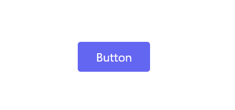
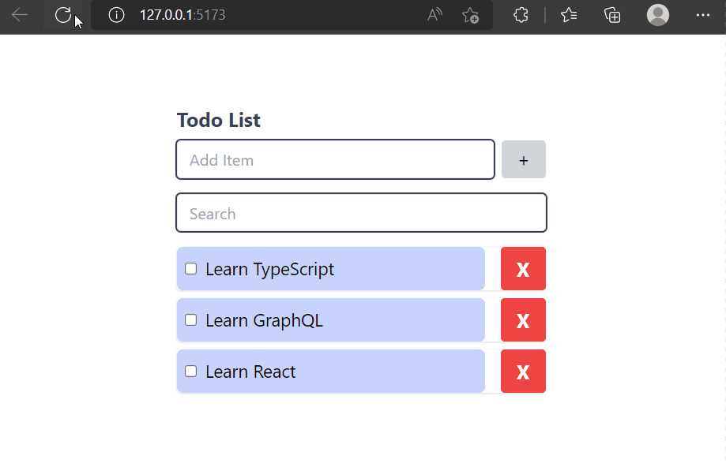
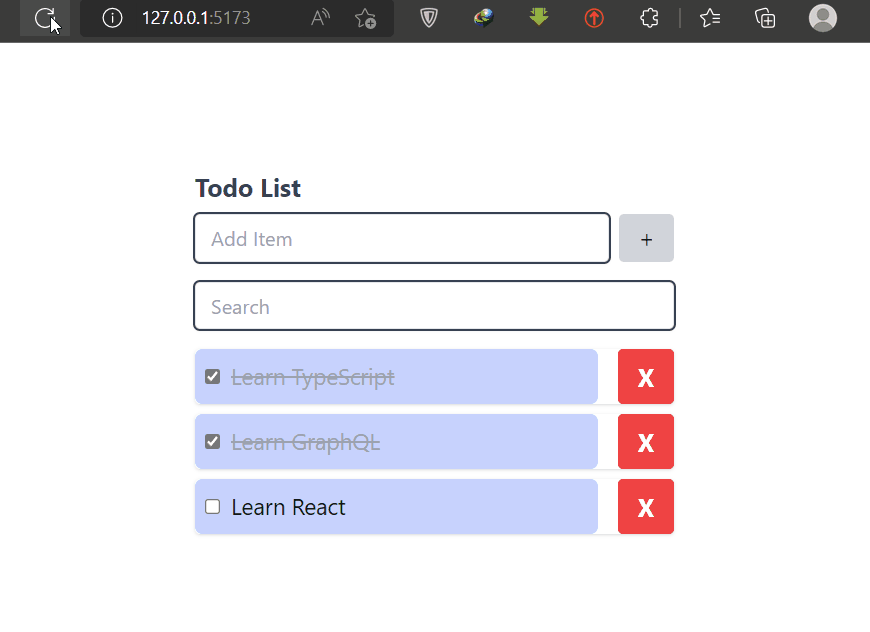
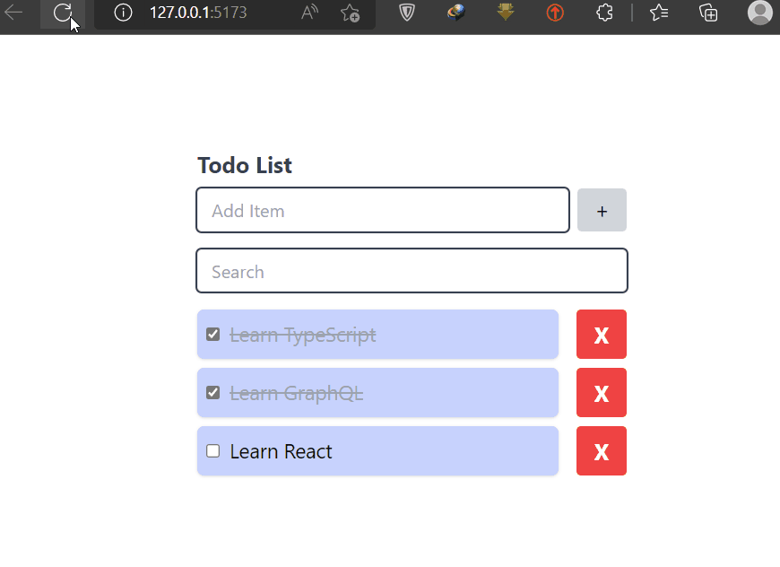

# Animation in React

- [Animation in React](#animation-in-react)
	- [Framer Motion](#framer-motion)
		- [motion component](#motion-component)
			- [`animate` prop](#animate-prop)
			- [`initial` prop](#initial-prop)
			- [keyframes](#keyframes)
			- [transition](#transition)
		- [Gesture Animations](#gesture-animations)
		- [Animate on exit: `AnimatePresence`](#animate-on-exit-animatepresence)
		- [Variants](#variants)
			- [passing variants to children](#passing-variants-to-children)
		- [List Items Staggering transition v1 (without exit animation)](#list-items-staggering-transition-v1-without-exit-animation)
		- [List Items Staggering transition v2 (with exit animation)](#list-items-staggering-transition-v2-with-exit-animation)
	- [React Spring](#react-spring)

## Framer Motion

- [https://www.framer.com/docs/introduction/](https://www.framer.com/docs/introduction/)

### motion component

These are the building blocks of Framer motion. Motion components are created by prefixing `motion` to your regular HTML and SVG element (e.g, `motion.h1`).

```tsx
import { motion } from 'framer-motion';
const Motion = () => {
 return (
  <motion.h1>
   This is a motion component
  </motion.h1>
 );
};
```

#### `animate` prop

Motion components can accept several props, with the basic one being the `animate` prop. This prop takes in an object where we define the properties of that component we want to animate. The properties we define will be animated when the component mounts in the DOM.

```tsx
import { motion } from 'framer-motion';

const Motion = () => {
 return (
  <motion.h1 animate={{ x: 40, y: 40 }}>
   This is a motion component
  </motion.h1>
 );
};
```

This will cause the `h1` to slide `40px` to the right and move `40px` up when it loads. When units aren’t added, calculations are done using pixels. However, you can explicitly set the units you want the calculations to be based on, `animate={{x: "20rem", y: "-20rem"}}>`.

#### `initial` prop

`animate` is the final state of the component. It’s the state the component will be in when the animation is complete. However, we can also define the **initial state** of the component using the `initial` prop. This prop takes in an object where we define the properties of the component we want to animate. The properties we define will be animated when the component mounts in the DOM.

```tsx
<motion.h1
    initial={{x: -1000}}
    animate={{x: 20}}>
   This is a motion component
</motion.h1>
```

#### keyframes

We are not limited to a single animation. We can define a series of animations called `keyframes` in an array of values. Each value will get animated in sequence.

```tsx
<motion.h1
    initial={{x: -1000}}
    animate={{x: [20, 50, 0, -70, 40] }}>
   This is a motion component
</motion.h1>
```

#### transition

The `transition` prop allows us to define how the animations occur. With it, we define how values animate from one state to another. Among other things, we can define the `duration`, `delay`, and `type` of animation using this prop.

```tsx
<motion.h1
   initial={{ x: -1000 }}
   animate={{ x: 10 }}
   transition={{
    type: 'tween',
    duration: 2,
    ease: 'easeInOut'
   }}>
   This is a motion component
  </motion.h1>
```

### Gesture Animations

Motion provides `whileHover` and `whileTap` helper props that will temporarily animate a component to a visual state while a gesture is active.

<div align="center">

</div>

```tsx
<motion.button
 whileHover={{ scale: 1.1 }}
 whileTap={{ scale: 0.9, x: '-5px', y: '5px' }}
 className='bg-indigo-500 hover:bg-indigo-600 text-white  py-2 px-6 rounded'>
 Button
</motion.button>
```

### Animate on exit: `AnimatePresence`

- [https://www.framer.com/docs/animate-presence/](https://www.framer.com/docs/animate-presence/)

`AnimatePresence` allows components to animate out when they're removed from the React tree.

<div align="center">

</div>

AnimatePresence works by detecting when **direct children** are removed from the React tree.

Any `motion` components contained by the removed child that have an `exit` prop will fire that animation before the entire tree is finally removed from the DOM.

Note: Direct children must each have a unique `key` prop so AnimatePresence can track their presence in the tree.

```tsx
const ListItems = ({ items, handleCheck, handleDelete }: ListItemsProps) => {
 return (
  <ul >
   <AnimatePresence>
    {items?.length &&
     items.map((item) => (
      <motion.li
       key={item.id}
       initial={{ x: -100, opacity: 0 }}
       animate={{ x: 0, opacity: 1 }}
       exit={{ x: -100, opacity: 0 }}
       transition={{ duration: 0.5 }}>
       <div>
        <input/>
        <label/>
       </div>
       <button/>
      </motion.li>
     ))}
   </AnimatePresence>
  </ul>
 );
};
```

### Variants

Say we were to animate several motion components simultaneously, like in the code snippet below.

```tsx
<div>
 <motion.h1
  initial={{ x: -1000 }} animate={{ x: 0 }}
  transition={{type: 'tween',duration: 2, delay: 1}}>
  This is a motion h1
 </motion.h1>
 <motion.h2
  initial={{ y: -1000 }} animate={{ y: 0 }}
  transition={{ type: 'tween', duration: 1, delay: 0.4}}>
  This is a motion h2
 </motion.h2>
</div>
```

While this works, the `variants` prop in Framer Motion enables us to extract our animation definitions into a variants object. Not only do variants make our code cleaner, but they allow us to create even more powerful and complex animations.

Extracting our animation definitions into variants objects, we have this:

```ts
const H1Variants = {
 initial: { x: -1000 },
 animate: { x: 0 },
 transition: {
  type: 'tween',
  duration: 2,
  delay: 1
 }
};
const H2Variants = {
 initial: { y: -1000 },
 animate: { y: 0 },
 transition: {
  type: 'tween',
  duration: 1,
  delay: 0.4
 }
};

```

Instead of passing the animation definitions into a component’s `initial` and `animate` props directly, we extract these definitions into standalone `variant` objects. In the variant objects, we define variant names that describe each animation’s name as variants.

```tsx
<div>
 <motion.h1
 variants={H1Variants}
 initial='initial'
 animate='animate'>
  This is a motion h1
 </motion.h1>

 <motion.h2
 variants={H2Variants}
 initial='initial'
 animate='animate'>
  This is a motion h2
 </motion.h2>
</div>
```

#### passing variants to children

We can take our current setup with variants further to reduce repetition. Using variants, we can propagate animation attributes down through the DOM from a parent motion component. For this to work, we create variants for the parent `motion.div` with similar animation names in its variant object as its children. By doing this, we won’t have to pass the animation names’ to each child component. Behind the scenes, the parent element handles that for us.

```tsx
const ContainerVariants = {
 initial: {},
 animate: {}
};

const H1Variants = {
 initial: { x: -1000 },
 animate: { x: 0 },
 transition: {
  type: 'tween',
  duration: 2,
  delay: 1
 }
};
const H2Variants = {
 //...
};

const Motion = () => {
 return (
  <motion.div variants={ContainerVariants} initial='initial' animate='animate'>
   <motion.h1 variants={H1Variants}>This is a motion h1</motion.h1>
   <motion.h2 variants={H2Variants}>This is a motion h2</motion.h2>
  </motion.div>
 );
};
```

Now we have a cleaner code with no repetitions. We turned the container div to a motion component so we could pass in the `ContainerVariants` object we defined. Since we don’t define any animations on the container, we pass in empty objects to initial and animate. Your animation names must be the same in every variant object for the propagation to work.

### List Items Staggering transition v1 (without exit animation)

with `staggerChildren` and `layoutId` props:

- [staggerChildren](https://www.framer.com/docs/transition/#orchestration)
- [namespace-layoutid](https://www.framer.com/docs/layout-group/#namespace-layoutid)

<div align="center">

</div>

With variants, we can create timing relationships between parent and children motion components.  Using the `staggerChildren` property, we set a timing order for each `li`. Each link will take `0.5` seconds to appear one after the other. This creates a nice visual cue . In the `liVariants` we animate the opacity and the vertical position of each link.

```tsx
const container = {
 hidden: { opacity: 0 },
 show: {
  opacity: 1,
  transition: {
   type: 'tween',
   duration: 0.5,
   ease: 'easeInOut',
   staggerChildren: 0.3
  }
 }
};

const liVariants = {
 hidden: {
  opacity: 0
 },
 show: {
  opacity: 1
 }
};

const ListItems = ({ items, handleCheck, handleDelete }: ListItemsProps) => {
 return (
  <motion.ul
  variants={container}
  initial='hidden'
  animate='show'>
   <AnimatePresence>
    {items?.length &&
     items.map((item) => (
      <motion.li
       key={item.id}
       layoutId={item.id.toString()}
       variants={liVariants}
       >
       <div >
        <input/>
        <label/>
       </div>
       <button/>
      </motion.li>
     ))}
   </AnimatePresence>
  </motion.ul>
 );
};
```

Components expecting to perform shared layout animations are provided a `layoutId` prop.

### List Items Staggering transition v2 (with exit animation)

- using `custom` prop.

<div align="center">

</div>

```tsx
const liVariants = {
 hidden: { opacity: 0 },
 show: (custom: number) => ({
  opacity: 1,
  transition: {
   delay: custom
  }
 }),
 exit: {
  opacity: 0,
  x: -100
 }
};

const ListItems = ({ items, handleCheck, handleDelete }: ListItemsProps) => {
 return (
  <motion.ul>
   <AnimatePresence>
    {items?.length &&
     items.map((item) => (
      <motion.li
       key={item.id}
       layoutId={item.id.toString()}
       variants={liVariants}
       initial='hidden'
       animate='show'
       exit='exit'
       custom={(item.id + 1) * 0.05}
       whileHover={{ scale: 1.02 }}
      >
       <div >
        <input/>
        <label/>
       </div>
       <button/>
      </motion.li>
     ))}
   </AnimatePresence>
  </motion.ul>
 );
};
```

## React Spring
