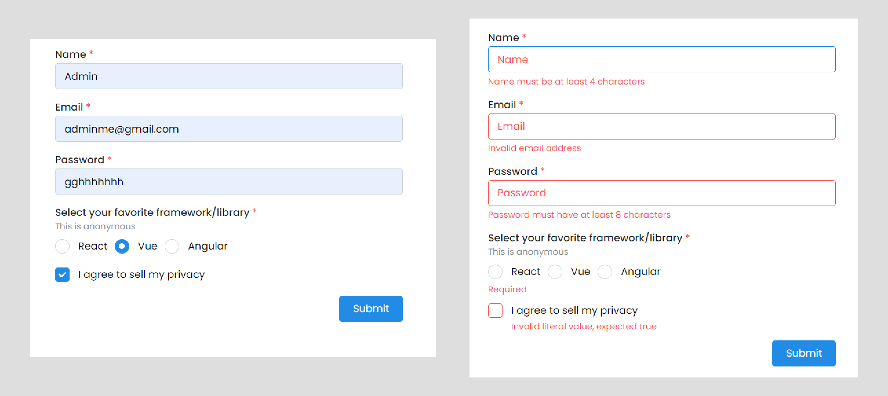
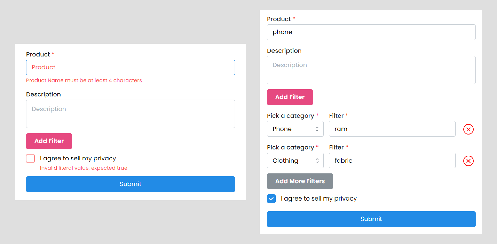

# React Hook Form

## Resources

- [https://www.austinshelby.com/blog/build-a-react-form-with-react-hook-form-and-zod](https://www.austinshelby.com/blog/build-a-react-form-with-react-hook-form-and-zod)

## Introduction

```tsx
import { TextInput, Checkbox, Button, Group, Box, Flex } from '@mantine/core';
import { useForm } from 'react-hook-form';
type Inputs = {
 name: string;
 email: string;
 password: string;
 termsOfService: boolean;
};
function Demo() {
 const {
  register,
  handleSubmit,
  watch,
  formState: { errors }
 } = useForm<Inputs>();
 const onSubmit = (data: Inputs) => window.alert(JSON.stringify(data, null, 4));

 return (
  <div className='flex items-center min-h-screen '>
   <form onSubmit={handleSubmit(onSubmit)} className='mx-auto w-full px-4 md:w-1/3'>
    <Flex direction={'column'} gap='sm'>
     <TextInput label='Name' placeholder='Name' {...register('name')} />
     <TextInput label='Email' placeholder='Email' {...register('email')} />
     <TextInput label='Password' placeholder='Password' {...register('password')} />

     <Checkbox label='I agree to sell my privacy' {...register('termsOfService')} />
     <Group position='right'>
      <Button
       type='submit'
       style={{
        fontWeight: 400
       }}>
       Submit
      </Button>
     </Group>
    </Flex>
   </form>
  </div>
 );
}

export default Demo;
```

## Validate React Forms With React Hook Form

<div align="center">

</div>

### with native HTML5 validation

To apply validations to a field, you can pass validation parameters to the register method. Validation parameters are similar to the existing HTML form validation standard.

These validation parameters include the following properties:

- `required` indicates if the field is required or not. If this property is set to true, then the field cannot be empty
- `minlength` and maxlength set the minimum and maximum length for a string input value
- `min` and max set the minimum and maximum values for a numerical value
- `pattern` defines a pattern for the input value using a regular expression.

```tsx
import { TextInput, Checkbox, Button, Group, Box, Flex, Radio } from '@mantine/core';
import { useForm } from 'react-hook-form';
type Inputs = {
 name: string;
 email: string;
 password: string;
 termsOfService: boolean;
 radio_option: string;
};
const registerOptions = {
 name: {
  required: 'Name is required',
  minLength: {
   value: 4,
   message: 'Name must be at least 4 characters'
  }
 },
 email: {
  required: 'Email is required',
  pattern: {
   value: /^[A-Z0-9._%+-]+@[A-Z0-9.-]+\.[A-Z]{2,}$/i,
   message: 'Invalid email address'
  }
 },
 password: {
  required: 'Password is required',
  minLength: {
   value: 8,
   message: 'Password must have at least 8 characters'
  }
 },
 termsOfService: {
  required: 'You must accept terms of service'
 },
 radio_option: {
  required: 'You must select an Options'
 }
};
const options = ['react', 'vue', 'angular'];
function Demo() {
 const {
  register,
  handleSubmit,
  watch,
  formState: { errors }
 } = useForm<Inputs>();
 const onSubmit = (data: Inputs) => window.alert(JSON.stringify(data, null, 4));
 console.log(errors);
 console.log(watch('radio_option'));

 return (
  <div className='flex items-center min-h-screen '>
   <form onSubmit={handleSubmit(onSubmit)} className='mx-auto w-full px-4 md:w-1/3'>
    <Flex direction={'column'} gap='sm'>
     <TextInput
      withAsterisk
      label='Name'
      placeholder='Name'
      {...register('name', registerOptions.name)}
      error={errors.name && errors.name.message}
     />
     <TextInput
      withAsterisk
      label='Email'
      placeholder='Email'
      {...register('email', registerOptions.email)}
      error={errors.email && errors.email.message}
     />
     <TextInput
      withAsterisk
      label='Password'
      placeholder='Password'
      {...register('password', registerOptions.password)}
      error={errors.password && errors.password.message}
     />
     <Radio.Group
      label='Select your favorite framework/library'
      description='This is anonymous'
      withAsterisk
      spacing='xs'
      name='radio_option'
      error={errors.radio_option && errors.radio_option.message}>
      <Radio
       value='react'
       label='React'
       {...register('radio_option', registerOptions.radio_option)}
      />
      <Radio
       value='svelte'
       label='Svelte'
       {...register('radio_option', registerOptions.radio_option)}
      />
      <Radio
       value='ng'
       label='Angular'
       {...register('radio_option', registerOptions.radio_option)}
      />
      <Radio
       value='vue'
       label='Vue'
       {...register('radio_option', registerOptions.radio_option)}
      />
     </Radio.Group>
     <Checkbox
      label='I agree to sell my privacy'
      {...register('termsOfService', registerOptions.termsOfService)}
      error={errors.termsOfService && errors.termsOfService.message}
     />
     <Group position='right'>
      <Button
       type='submit'
       style={{
        fontWeight: 400
       }}>
       Submit
      </Button>
     </Group>
    </Flex>
   </form>
  </div>
 );
}

export default Demo;
```

### with resolver: `yup`, `zod`,  etc

Validating with `zod`

```sh
yarn add zod @hookform/resolvers
```

```tsx
import { TextInput, Checkbox, Button, Group, Box, Flex, Radio } from '@mantine/core';
import { z } from 'zod';
import { SubmitHandler, useForm, Controller } from 'react-hook-form';
import { zodResolver } from '@hookform/resolvers/zod';
import Layout from '../components/Layout';

const FormSchema = z.object({
 name: z.string().min(4, 'Name must be at least 4 characters'),
 email: z.string().email('Invalid email address'),
 password: z.string().min(8, 'Password must have at least 8 characters'),
 termsOfService: z.literal(true, {
  invalid_type_error: 'You must accept Terms and Conditions.'
 }),
 radio_option: z
  .string({ invalid_type_error: 'Please select option.' })
  .refine((val) => options.map((option) => option.id).includes(val))
});
type FormSchemaType = z.infer<typeof FormSchema>; // Inferred Type

const options = [
 {
  id: 'react',
  label: 'React'
 },
 {
  id: 'vue',
  label: 'Vue'
 },
 {
  id: 'angular',
  label: 'Angular'
 }
];
function Demo() {
 const {
  register,
  handleSubmit,
  watch,
  control,
  formState: { errors }
 } = useForm<FormSchemaType>({
  resolver: zodResolver(FormSchema)
 });

 const onSubmit: SubmitHandler<FormSchemaType> = (data) =>
  window.alert(JSON.stringify(data, null, 4));

 return (
  <Layout>
   <form onSubmit={handleSubmit(onSubmit)} className='mx-auto w-full px-4 md:w-1/3'>
    <Flex direction={'column'} gap='sm'>
     <TextInput
      withAsterisk
      label='Name'
      placeholder='Name'
      {...register('name')}
      error={errors.name && errors.name.message}
     />
     <TextInput
      withAsterisk
      label='Email'
      placeholder='Email'
      {...register('email')}
      error={errors.email && errors.email.message}
     />
     <TextInput
      withAsterisk
      label='Password'
      placeholder='Password'
      {...register('password')}
      error={errors.password && errors.password.message}
     />
     <Controller
      name='radio_option'
      control={control}
      render={({ field }) => (
       <Radio.Group
        label='Select your favorite framework/library'
        description='This is anonymous'
        withAsterisk
        spacing='xs'
        name='radio_option'
        {...(field as any)}
        error={errors.radio_option && errors.radio_option.message}>
        {options.map((option) => (
         <Radio key={option.id} value={option.id} label={option.label} />
        ))}
       </Radio.Group>
      )}
     />
     <Checkbox
      label='I agree to sell my privacy'
      {...register('termsOfService')}
      error={errors.termsOfService && errors.termsOfService.message}
     />
     <Group position='right'>
      <Button
       type='submit'
       style={{
        fontWeight: 400
       }}>
       Submit
      </Button>
     </Group>
    </Flex>
   </form>
  </Layout>
 );
}

export default Demo;
```

## Dynamic Form with useFieldArray

<div align="center">

</div>

```tsx
import {
 TextInput,
 Checkbox,
 Button,
 Group,
 Flex,
 Select,
 ActionIcon,
 CloseButton,
 JsonInput,
 Container,
 Textarea
} from '@mantine/core';
import { z } from 'zod';
import { SubmitHandler, useForm, Controller, useFieldArray } from 'react-hook-form';
import { zodResolver } from '@hookform/resolvers/zod';
import Layout from '../components/Layout';
import React from 'react';
import { SlClose } from 'react-icons/sl';

const elementSchema = z.object({
 category: z
  .string({ invalid_type_error: 'Please select option.' })
  .refine((val) => options.map((option) => option.value).includes(val)),
 filter_value: z.string().min(3, 'Category must be at least 4 characters')
});

const FormSchema = z.object({
 product: z.string().min(4, 'Product Name must be at least 4 characters'),
 termsOfService: z.literal(true, {
  invalid_type_error: 'You must accept Terms and Conditions.'
 }),
 description: z.optional(z.string()),
 filters: z.array(elementSchema)
});
type FormSchemaType = z.infer<typeof FormSchema>;

const options = [
 { value: 'phone', label: 'Phone' },
 { value: 'laptop', label: 'Laptop' },
 { value: 'clothing', label: 'Clothing' }
];
function Demo() {
 const {
  register,
  handleSubmit,
  watch,
  control,
  formState: { errors }
 } = useForm<FormSchemaType>({
  resolver: zodResolver(FormSchema)
 });
 const { fields, append, prepend, remove, swap, move, insert } = useFieldArray({
  control, // control props comes from useForm (optional: if you are using FormContext)
  name: 'filters' // unique name for your Field Array
 });

 const onSubmit: SubmitHandler<FormSchemaType> = (data) =>
  window.alert(JSON.stringify(data, null, 4));

 console.log(errors);

 return (
  <Layout>
   <form onSubmit={handleSubmit(onSubmit)} className='mx-auto w-full px-4 md:w-1/3'>
    <Flex direction={'column'} gap='sm'>
     <TextInput
      withAsterisk
      label='Product'
      placeholder='Product'
      {...register('product')}
      error={errors.product && errors.product.message}
     />
     <Textarea
      label='Description'
      placeholder='Description'
      error={errors.description && errors.description.message}
      {...register('description')}
     />
     <Group position='left'>
      <Button
       color={'pink'}
       onClick={() => {
        append({ category: '', filter_value: '' });
       }}>
       Add Filter
      </Button>
     </Group>
     {fields.map((field, index) => {
      return (
       <Flex gap={'sm'} key={field.id} align='end'>
        <Controller
         name={`filters.${index}.category`}
         rules={{ required: true }}
         control={control}
         render={({ field }) => (
          <Select
           label='Pick a category'
           placeholder='Pick one'
           withAsterisk
           {...(field as any)}
           data={options}
           error={errors.filters?.[index]?.category?.message}
          />
         )}
        />
        <TextInput
         withAsterisk
         label='Filter'
         placeholder='Add Filter Value'
         sx={{ width: '100%' }}
         // {...register('filter_value')}
         // error={errors.filter_value && errors.filter_value.message}
         {...register(`filters.${index}.filter_value`)}
         error={errors.filters?.[index]?.filter_value?.message}
        />
        <ActionIcon size={'lg'} onClick={() => remove(index)}>
         <SlClose
          style={{
           width: '1.5rem',
           height: '1.5rem',
           color: 'red'
          }}
         />
        </ActionIcon>
       </Flex>
      );
     })}
     {watch('filters')?.length > 0 && (
      <Group position='left'>
       <Button
        color='gray'
        onClick={() => {
         append({ category: '', filter_value: '' });
        }}>
        Add More Filters
       </Button>
      </Group>
     )}
     <Checkbox
      label='I agree to sell my privacy'
      {...register('termsOfService')}
      error={errors.termsOfService && errors.termsOfService.message}
     />

     <Button
      type='submit'
      style={{
       fontWeight: 400,
       width: '100%'
      }}>
      Submit
     </Button>
    </Flex>
   </form>
  </Layout>
 );
}

export default Demo;

```
