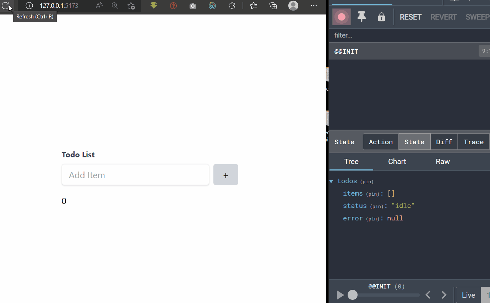

# Redux-Toolkit

- [Redux-Toolkit](#redux-toolkit)
  - [Core Concept](#core-concept)
  - [Installation](#installation)
  - [Basic Usage](#basic-usage)
    - [Store](#store)
    - [Provider](#provider)
    - [Slice](#slice)
      - [Using Slice](#using-slice)
  - [AsyncThunk](#asyncthunk)
    - [store](#store-1)
    - [Server Setup](#server-setup)
    - [`createAsyncThunk`](#createasyncthunk)
    - [usage](#usage)
  - [Snippets](#snippets)
  - [Resources](#resources)

## Core Concept

- `store` that holds the whole state tree of your application.
- `action` that describes what happened in the application.
  - *For example, a user clicked a button, or a network request returned some data.*
- `reducer` that determines how the state is updated in response to an action.
  - *For example, a reducer might increment a counter value in response to a click action.*

react-redux:

- `selector` that selects a slice of state from the store.
  - *For example, a selector might select a list of todos from the state.*

## Installation

```bash
yarn add @reduxjs/toolkit react-redux axios

```

## Basic Usage

### Store

```ts
import { configureStore, createSlice, PayloadAction } from '@reduxjs/toolkit';
const store = configureStore({
 reducer: {},
 devTools: true
});

export default store;
export type RootState = ReturnType<typeof store.getState>;
```

### Provider

`main.tsx`

```tsx
import React from 'react';
import ReactDOM from 'react-dom/client';
import { Provider } from 'react-redux';
import App from './App';
import './index.css';
import store from './store';

ReactDOM.createRoot(document.getElementById('root') as HTMLElement).render(
 // <React.StrictMode>
 <Provider store={store}>
  <App />
 </Provider>
 // </React.StrictMode>
);
```

### Slice

`state/cartItemsSlice.ts`

```ts
import { createSlice, PayloadAction } from '@reduxjs/toolkit';
import { RootState } from './store';
interface CartItem {
 id: number;
 productId: number;
 quantity: number;
 unitPrice: number;
 productName: string;
}
const dummyData: CartItem[] = [
 {
  id: 1,
  productId: 1,
  quantity: 1,
  unitPrice: 100,
  productName: 'Product 1'
 },
 {
  id: 2,
  productId: 2,
  quantity: 1,
  unitPrice: 200,
  productName: 'Product 2'
 }
];

export interface CartItemsState {
 cartItems: CartItem[];
 isLoading: boolean;
 amount: number;
}

const initialState: CartItemsState = {
 cartItems: dummyData,
 isLoading: false,
 amount: 0
};

export const cartItemsSlice = createSlice({
 name: 'cartItems',
 initialState: initialState,
 reducers: {
  clearCart: (state: CartItemsState) => {
   state.cartItems = [];
  },
  removeItem: (state: CartItemsState, action: PayloadAction<number>) => {
   const id = action.payload;
   state.cartItems = state.cartItems.filter((cartItem) => cartItem.id !== id);
  },
  increaseQuantity: (state: CartItemsState, action: PayloadAction<number>) => {
   const id = action.payload;
   const cartItem = state.cartItems.find((cartItem) => cartItem.id === id);
   if (cartItem) {
    cartItem.quantity++;
   }
  },
  decreaseQuantity: (state: CartItemsState, action: PayloadAction<number>) => {
   const id = action.payload;
   const cartItem = state.cartItems.find((cartItem) => cartItem.id === id);
   if (cartItem) {
    if (cartItem.quantity > 1) {
     cartItem.quantity--;
    }
   }
  },
  calculateTotal: (state: CartItemsState) => {
   state.amount = state.cartItems.reduce((total, cartItem) => {
    return total + cartItem.quantity * cartItem.unitPrice;
   }, 0);
  }
 },
 extraReducers: {}
});
// actions to dispatch
export const { clearCart, removeItem, increaseQuantity, decreaseQuantity, calculateTotal } =
 cartItemsSlice.actions;
// accessing state
export const selectCartItems = (state: RootState) => state.cartItems;
// reducer for configureStore
export const cartItemsReducer = cartItemsSlice.reducer;

```

#### Using Slice

Using `cartItemsReducer` inside `store.ts`:

```ts
import { configureStore, createSlice, PayloadAction } from '@reduxjs/toolkit';
import { cartItemsReducer } from './cartItemsSlice';

const store = configureStore({
 reducer: {
  cartItems: cartItemsReducer
 },
 devTools: true
});

export default store;
export type RootState = ReturnType<typeof store.getState>;

```

Using `Actions and Selectors` in tsx:

```tsx
import React, { useEffect } from 'react';
import { useDispatch, useSelector } from 'react-redux';
import {
 calculateTotal,
 decreaseQuantity,
 increaseQuantity,
 selectCartItems
} from '../state/cartItemsSlice';

const CartItem = () => {
 const { cartItems, isLoading, amount } = useSelector(selectCartItems);
 const dispatch = useDispatch();

 useEffect(() => {
  dispatch(calculateTotal());
 }, [cartItems]);

 return (
  <div className='flex flex-col space-y-4 h-screen items-center justify-center'>
   {cartItems.map((item, index) => {
    return (
     <div key={index} className='flex items-center w-1/2 space-x-2 justify-between'>
      <div className='flex flex-col w-1/2 h-20 bg-gray-200 rounded-md p-2 justify-between'>
       <div className='text-lg font-bold'>{item.productName}</div>
       <div className='text-sm'>${item.unitPrice}</div>
      </div>
      <div className='flex space-x-2'>
       <button
        className='bg-blue-500 text-white px-2 rounded flex items-center hover:bg-blue-600
       transition duration-200 ease-in-out justify-center '
        onClick={() => dispatch(decreaseQuantity(item.id))}>
        -
       </button>
       <div>{item.quantity}</div>
       <button
        className='bg-blue-500 text-white px-2 rounded flex items-center justify-center hover:bg-blue-600 transition duration-200 ease-in-out'
        onClick={() => dispatch(increaseQuantity(item.id))}>
        +
       </button>
      </div>
     </div>
    );
   })}
   <div className='text-2xl font-bold'>Total: {amount}</div>
  </div>
 );
};
export default CartItem;

```

## AsyncThunk

<div align="center">

</div>


### store


```typescript
import { configureStore, createSlice, PayloadAction } from '@reduxjs/toolkit';
import { useDispatch } from 'react-redux';
import { cartItemsReducer } from './cartItemsSlice';
import { todoReducer } from './todoSlice';
import { carsReducer } from './carslice';
const store = configureStore({
	reducer: {
		todos: todoReducer,
		cartItems: cartItemsReducer
	},
	devTools: true
});

export default store;
export type RootState = ReturnType<typeof store.getState>;
// enable thunk type support
export type AppDispatch = typeof store.dispatch;
export const useAppDispatch = () => useDispatch<AppDispatch>();
```

### Server Setup

`data/db.json`

```json
{
  "todos": [
    {
      "id": 1,
      "completed": false,
      "title": "Learn Angular"
    },
    {
      "id": 2,
      "completed": true,
      "title": "Learn React"
    },
    {
      "id": 3,
      "completed": true,
      "title": "Learn Vue"
    }
  ]
}
```

```bash
npx json-server -p 3500 -w data/db.json --delay 1000
curl http://localhost:3500/items
```

### `createAsyncThunk`


```typescript
import { createAsyncThunk, createSlice, PayloadAction } from '@reduxjs/toolkit';
import axios from 'axios';
import { RootState } from './store';

export type Todo = {
	id: number;
	title: string;
	completed: boolean;
};

type TodoSliceState = {
	status: 'loading' | 'idle';
	error: string | null;
	items: Todo[];
};
// createAsyncThunk<ReturnedType, PayloadType>
export const fetchTodos = createAsyncThunk<Todo[]>(
	'todos/fetch',
	async (payload: any, thunkAPI) => {
		try {
			const response = await axios.get<Todo[]>('http://localhost:3500/todos');
			return response.data;
		} catch (err: any) {
			return thunkAPI.rejectWithValue(err.message);
		}
	}
);
export const deleteTodo = createAsyncThunk<number, number>(
	'todos/delete',
	async (id: number, thunkAPI) => {
		try {
			await axios.delete<number>(`http://localhost:3500/todos/${id}`);
			return id;
		} catch (err: any) {
			return thunkAPI.rejectWithValue(err.message);
		}
	}
);
export const addTodo = createAsyncThunk<Todo, string>(
	'todos/add',
	async (title: string, thunkAPI) => {
		try {
			const state = thunkAPI.getState() as RootState;
			const items = state.todos.items;

			const id = items.length ? items[items.length - 1].id + 1 : 1;
			const newItem = { id, completed: false, title };
			const response = await axios.post<Todo>(`http://localhost:3500/todos`, newItem);
			return response.data;
		} catch (err: any) {
			return thunkAPI.rejectWithValue(err.message);
		}
	}
);
export const updateTodo = createAsyncThunk<Todo, Todo>(
	'todos/update',
	async (todo: Todo, thunkAPI) => {
		try {
			const response = await axios.put<Todo>(`http://localhost:3500/todos/${todo.id}`, todo);
			return response.data;
		} catch (err: any) {
			return thunkAPI.rejectWithValue(err.message);
		}
	}
);

const initialState: TodoSliceState = {
	items: [],
	status: 'idle',
	error: null
};

export const todoSlice = createSlice({
	name: 'todo',
	initialState: initialState,
	reducers: {},
	extraReducers: (builder) => {
		builder
			.addCase(fetchTodos.pending, (state: TodoSliceState) => {
				state.status = 'loading';
			})
			.addCase(fetchTodos.fulfilled, (state: TodoSliceState, action: PayloadAction<Todo[]>) => {
				state.status = 'idle';
				state.items = action.payload;
			})
			.addCase(fetchTodos.rejected, (state: TodoSliceState, action: PayloadAction<any>) => {
				state.status = 'idle';
				state.error = action.payload;
			})
			.addCase(deleteTodo.pending, (state: TodoSliceState) => {
				state.status = 'loading';
			})
			.addCase(deleteTodo.fulfilled, (state: TodoSliceState, action: PayloadAction<number>) => {
				state.status = 'idle';
				state.items = state.items.filter((todo) => todo.id !== action.payload);
			})
			.addCase(deleteTodo.rejected, (state: TodoSliceState, action: PayloadAction<any>) => {
				state.status = 'idle';
				state.error = action.payload;
			})
			.addCase(addTodo.pending, (state: TodoSliceState) => {
				state.status = 'loading';
			})
			.addCase(addTodo.fulfilled, (state: TodoSliceState, action: PayloadAction<Todo>) => {
				state.status = 'idle';
				state.items.push(action.payload);
			})
			.addCase(addTodo.rejected, (state: TodoSliceState, action: PayloadAction<any>) => {
				state.status = 'idle';
				state.error = action.payload;
			})
			.addCase(updateTodo.pending, (state: TodoSliceState) => {
				state.status = 'loading';
			})
			.addCase(updateTodo.fulfilled, (state: TodoSliceState, action: PayloadAction<Todo>) => {
				state.status = 'idle';
				state.items = state.items.map((todo) =>
					todo.id === action.payload.id ? action.payload : todo
				);
			})
			.addCase(updateTodo.rejected, (state: TodoSliceState, action: PayloadAction<any>) => {
				state.status = 'idle';
				state.error = action.payload;
			});
	}
});
// accessing state
export const selectTodos = (state: RootState) => state.todos;
// reducer for configureStore
export const todoReducer = todoSlice.reducer;

```

### usage

```tsx
import React, { useRef, useEffect } from 'react';
import toast from 'react-hot-toast';
import { useSelector } from 'react-redux';
import { BeatLoader } from 'react-spinners';
import { useAppDispatch } from '../state/store';
import { addTodo, deleteTodo, fetchTodos, selectTodos, updateTodo } from '../state/todoSlice';
const clsx = (...args: any[]) => {
	return args.filter(Boolean).join(' ');
};

const AddItem = () => {
	const inputRef = useRef<HTMLInputElement>(null);
	const dispatch = useAppDispatch();
	const handleSubmit = (e: React.FormEvent<HTMLFormElement>) => {
		e.preventDefault();
		if (inputRef.current) {
			const value = inputRef.current.value;
			if (value) {
				dispatch(addTodo(value));
				inputRef.current.value = '';
				toast.success('Todo added');
			}
		}
	};

	return (
		<form onSubmit={handleSubmit}>
			<label className='block text-gray-700 text-sm font-bold mb-2'> Todo List </label>
			<div className='flex space-x-2 mb-4'>
				<input
					autoFocus
					ref={inputRef}
					id='addItem'
					type='text'
					placeholder='Add Item'
					className='shadow appearance-none border rounded w-full py-2 px-3 text-gray-700 leading-tight  focus:outline-indigo-400 '
					required
				/>
				<button
					className=' bg-gray-300 rounded px-4 text-lg'
					onClick={() => inputRef.current?.focus()}>
					+
				</button>
			</div>
		</form>
	);
};

const ListItems = () => {
	const { items, status, error } = useSelector(selectTodos);
	const dispatch = useAppDispatch();

	useEffect(() => {
		dispatch(fetchTodos());
	}, []);

	let content: React.ReactElement = <div></div>;

	if (status === 'loading') {
		content = (
			<div>
				<BeatLoader color='#36d7b7' />
			</div>
		);
	} else if (status === 'idle' && !error) {
		content = (
			<ul className='mt-4'>
				{items?.length &&
					items.map((item) => (
						<li key={item.id} className='flex justify-between  rounded shadow mb-2 space-x-4'>
							<div className='flex bg-indigo-200 w-full p-2 rounded-md'>
								<input
									type='checkbox'
									checked={item.completed}
									onChange={() => {
										dispatch(
											updateTodo({
												id: item.id,
												completed: !item.completed,
												title: item.title
											})
										);
										toast.success('Todo Updated');
									}}
								/>
								<label
									className={clsx(
										'text-lg pl-2',
										item.completed && 'line-through text-gray-400'
									)}>
									{item.title}
								</label>
							</div>
							<button
								className='text-white font-bold bg-red-500 rounded px-4 text-xl'
								onClick={() => {
									dispatch(deleteTodo(item.id));
									toast.success('Item deleted');
								}}>
								X
							</button>
						</li>
					))}
			</ul>
		);
	} else if (error) {
		content = <div>{error}</div>;
	}

	return content;
};

const TodoList = () => {
	return (
		<div className='h-screen flex items-center justify-center flex-col'>
			<div className='w-1/2'>
				<AddItem />
				<ListItems />
			</div>
		</div>
	);
};
export default TodoList;
```


## Snippets

- Creating `Slice`

`typscript.json`

```json
{
 "rt-Slice": {
  "prefix": "rts",
  "body": [
   "import { createSlice, PayloadAction } from '@reduxjs/toolkit';",
   "import { RootState } from './store';",
   "",
   "interface ${2:Type} {",
   " $3",
   "}",
   "interface ${4:${TM_FILENAME_BASE/(.*)/${1:/capitalize}/}}State {",
   " ${5:value}: ${2:Type}[];",
   "}",
   "",
   "const initialState: ${4:${TM_FILENAME_BASE/(.*)/${1:/capitalize}/}}State = {",
   " ${5:value}: []",
   "};",
   "",
   "export const ${1:${TM_FILENAME_BASE}} = createSlice({",
   " name: '${5:value}',",
   " initialState: initialState,",
   " reducers: {",
   "  _: (state: ${4:${TM_FILENAME_BASE/(.*)/${1:/capitalize}/}}State, action: PayloadAction<string>) => {",
   "   ",
   "  },",
   "  ",
   " },",
   " extraReducers:{}",
   "});",
   "// actions to dispatch",
   "export const {  } = ${1:${TM_FILENAME_BASE}}.actions;",
   "// accessing state",
   "export const select${5/(.*)/${5:/capitalize}/} = (state: RootState) => state.${5:value};",
   "// reducer for configureStore",
   "export const ${5:value}Reducer = ${1:${TM_FILENAME_BASE}}.reducer;",
   ""
  ],
  "description": "Create Slice"
 }
}
```

## Resources

- [https://redux-toolkit.js.org/](https://redux-toolkit.js.org/)
- [https://www.youtube.com/watch?v=eFh2Kr9hfyo&t=680s](https://www.youtube.com/watch?v=eFh2Kr9hfyo&t=680s)
- [https://www.youtube.com/playlist?list=PLC3y8-rFHvwiaOAuTtVXittwybYIorRB3](https://www.youtube.com/playlist?list=PLC3y8-rFHvwiaOAuTtVXittwybYIorRB3)
