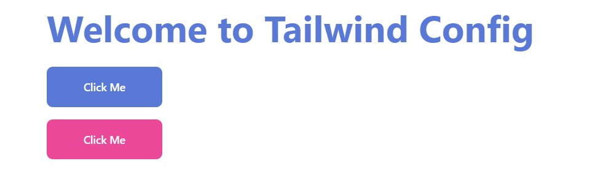

# Design System with Tailwind CSS

- [Design System with Tailwind CSS](#design-system-with-tailwind-css)
  - [Installation](#installation)
    - [Next.js + Tailwind](#nextjs--tailwind)
    - [Storybook](#storybook)
      - [Initializing Storybook](#initializing-storybook)
      - [Installing PostCSS Add-ons](#installing-postcss-add-ons)
      - [Adding Webpack as a resolution dependency](#adding-webpack-as-a-resolution-dependency)
      - [Replace `.storybook/main.js`](#replace-storybookmainjs)
      - [Replace `.storybook/preview.js`](#replace-storybookpreviewjs)
      - [Start Storybook](#start-storybook)
  - [Tailwind Config](#tailwind-config)
    - [Customizing Colors](#customizing-colors)
      - [Color Palette Generator](#color-palette-generator)
    - [Plugins: Add base styles](#plugins-add-base-styles)
  - [Integrating with Storybook](#integrating-with-storybook)
    - [`classnames` variant](#classnames-variant)
    - [`class-variance-authority` variant](#class-variance-authority-variant)

## Installation

### Next.js + Tailwind

```bash
yarn create next-app --typescript
cd...
yarn add -D tailwindcss postcss autoprefixer
npx tailwindcss init -p
```

Add the paths to all of your template files in your `tailwind.config.js` file.

```javascript
/** @type {import('tailwindcss').Config} */
module.exports = {
 content: ['./pages/**/*.{js,ts,jsx,tsx}', './components/**/*.{js,ts,jsx,tsx}'],
 theme: {
  extend: {}
 },
 plugins: []
};
```

To resolve `Parsing error : Cannot find module 'next/babel'` error, add the following to your `.eslintrc.json`

```json
{
 "extends": ["next", "prettier", "next/core-web-vitals"],
 "plugins": ["prettier"]
}
```

Also install prettier plugin if you don't have it already

```bash
yarn add -D eslint-config-prettier
```

Add the `@tailwind` directives for each of Tailwind’s layers to your `./styles/globals.css` file.

```css
@tailwind base;
@tailwind components;
@tailwind utilities;
```

Start using Tailwind’s utility classes to style your content.

`index.tsx`:

```typescript
export default function Home() {
  return (
    <h1 className="text-3xl font-bold underline">
      Hello world!
    </h1>
  )
}
```

### Storybook

- [https://storybook.js.org/blog/get-started-with-storybook-and-next-js/](https://storybook.js.org/blog/get-started-with-storybook-and-next-js/)
- [https://theodorusclarence.com/blog/nextjs-storybook-tailwind](https://theodorusclarence.com/blog/nextjs-storybook-tailwind)
- [https://getfishtank.ca/blog/configuring-nextjs-typescript-tailwind-storybook](https://getfishtank.ca/blog/configuring-nextjs-typescript-tailwind-storybook)

#### Initializing Storybook

This command will install the storybook to your Next.js repository, there will be a prompt asking if you want to additionally install an eslint plugin, I suggest you to accept.

```sh
npx -y sb init --builder webpack5
```

#### Installing PostCSS Add-ons

Tailwind CSS needs PostCSS to work, so we need to integrate it with Storybook using one of their pre-built add-ons.

```sh
yarn add -D @storybook/addon-postcss
```

#### Adding Webpack as a resolution dependency

We need this to ensure the webpack is installed as a dependency, somehow this will cause a bug if we don’t install it

Append this to your package.json

// package.json

```sh
"resolutions": {
    "webpack": "^5"
}
```

Then install the webpack resolutions with

```sh
yarn
```

#### Replace `.storybook/main.js`

Here is the custom main.js config that you can use

```js
// .storybook/main.js
module.exports = {
 stories: ['../components/**/*.stories.mdx', '../components/**/*.stories.@(js|jsx|ts|tsx)'],
 addons: [
  '@storybook/addon-links',
  '@storybook/addon-essentials',
  '@storybook/addon-interactions',
  {
   /**
    * Fix Storybook issue with PostCSS@8
    * @see https://github.com/storybookjs/storybook/issues/12668#issuecomment-773958085
    */
   name: '@storybook/addon-postcss',
   options: {
    postcssLoaderOptions: {
     implementation: require('postcss')
    }
   }
  }
 ],
 framework: '@storybook/react',
 core: {
  builder: '@storybook/builder-webpack5'
 }
};
```

#### Replace `.storybook/preview.js`

```javascript
// .storybook/preview.js
import '../styles/globals.css';

export const parameters = {
 actions: { argTypesRegex: '^on[A-Z].*' },
 controls: {
  matchers: {
   color: /(background|color)$/i,
   date: /Date$/
  }
 }
};
```

This file will load the Tailwind CSS from `globals.css` and mock NextImage to work with Storybook.

#### Start Storybook

```sh
yarn storybook
```

## Tailwind Config

- [defaultConfig.stub.js](https://github.com/tailwindlabs/tailwindcss/blob/master/stubs/defaultConfig.stub.js)

### Customizing Colors

Color object syntax:

```javascript
const customColors = primary: {
  // 1. named colors
  DEFAULT: '#5a79d7',
  light: '#7a9be0',
  medium: '#3c4db9',
  dark: '#303a78'
 },
secondary: {
  // 2. 10 color shades from 50 to 900 (50, 100, 200, ..., 900)
  DEFAULT: defaultColors.pink[500],
  '50': '#eff6ff',
  '100': '#dbeafe',
  '200': '#bfdbfe',
  '300': '#93c5fd',
  '400': '#60a5fa',
  '500': '#3b82f6',
  '600': '#2563eb',
  '700': '#1d4ed8',
  '800': '#1e40af',
  '900': '#1e3a8a'
 }
}
```

The special `DEFAULT` key can be used when you want to define a value with no suffix:

```javascript
/** @type {import('tailwindcss').Config} */
// https://github.com/tailwindlabs/tailwindcss/blob/master/stubs/defaultConfig.stub.js
const defaultColors = require('tailwindcss/colors');
const customColors = {
 primary: {
  DEFAULT: '#5a79d7',
  light: '#7a9be0',
  medium: '#3c4db9',
  dark: '#303a78'
 },
 secondary: {
  DEFAULT: defaultColors.pink[500],
  ...defaultColors.pink
 }
};

module.exports = {
 content: ['./pages/**/*.{js,ts,jsx,tsx}', './components/**/*.{js,ts,jsx,tsx}'],
 theme: {
  extend: {
   colors: customColors,
   ringColor: ({ theme }) => ({
    DEFAULT: theme('colors.primary.light'),
    ...theme('colors')
   })
  }
 },
 plugins: []
};
```

Usage:

```tsx
const Layout = ({ children }: any) => {
 return (
  <div className='flex flex-col items-start px-8 md:px-72 lg:px-96 pt-10 min-h-screen  space-y-4'>
   {children}
  </div>
 );
};

export default function Home() {
 return (
  <Layout>
   <button className='bg-primary hover:bg-primary-medium  rounded  px-12 py-3 text-sm font-medium text-white focus:outline-none focus:ring-2 ring-offset-1'>
    Click Me
   </button>
   <button className='bg-secondary hover:bg-secondary-600 rounded  px-12 py-3 text-sm font-medium text-white focus:outline-none focus:ring-2 ring-offset-1 ring-secondary-300'>
    Click Me
   </button>
  </Layout>
 );
}
```

<div align="center">

</div>

#### Color Palette Generator

- [https://uicolors.app/create](https://uicolors.app/create)
- [https://www.tailwindshades.com/](https://www.tailwindshades.com/)

### Plugins: Add base styles

- [https://tailwindcss.com/docs/plugins](https://tailwindcss.com/docs/plugins)
- [https://tailwindcss.com/docs/plugins#official-plugins](https://tailwindcss.com/docs/plugins#official-plugins)

```typescript
/** @type {import('tailwindcss').Config} */
// https://github.com/tailwindlabs/tailwindcss/blob/master/stubs/defaultConfig.stub.js
const defaultColors = require('tailwindcss/colors');
// https://tailwindcss.com/docs/plugins
const plugin = require('tailwindcss/plugin');

const customColors = {
 primary: {
  DEFAULT: '#5a79d7',
  light: '#7a9be0',
  medium: '#3c4db9',
  dark: '#303a78'
 },
 secondary: {
  DEFAULT: defaultColors.pink[500],
  ...defaultColors.pink
 }
};
module.exports = {
 content: ['./pages/**/*.{js,ts,jsx,tsx}', './components/**/*.{js,ts,jsx,tsx}'],
 theme: {
  extend: {
   colors: customColors,
   ringColor: ({ theme }) => ({
    DEFAULT: theme('colors.primary.light'),
    ...theme('colors')
   })
  }
 },
 plugins: [
  plugin(function ({ addUtilities, addComponents, e, config, theme, addBase }) {
   // Add your custom styles here
   addBase({
    h1: {
     color: theme('colors.primary.DEFAULT'),
     fontSize: theme('fontSize.5xl'),
     fontWeight: theme('fontWeight.bold')
    },
    button: {
     padding: `${theme('spacing.4')} ${theme('spacing.12')}`, // 1rem 3rem
     borderRadius: theme('borderRadius.lg'),
     backgroundColor: theme('colors.primary.DEFAULT'),
     color: theme('colors.white'),
     fontSize: theme('fontSize.sm'),
     fontWeight: theme('fontWeight.medium'),
     '&:hover': {
      backgroundColor: theme('colors.primary.medium')
     }
    }
   });
  })
 ]
};
```

Usage:

```tsx
export default function Home() {
 return (
  <Layout>
   <h1>Welcome to Tailwind Config</h1>
   <button className=' focus:outline-none focus:ring-2 ring-offset-1'>Click Me</button>
   <button className='bg-secondary hover:bg-secondary-600 text-sm font-medium text-white focus:outline-none focus:ring-2 ring-offset-1 ring-secondary-300'>
    Click Me
   </button>
  </Layout>
 );
}
```

Result:

<div align="center">

</div>

## Integrating with Storybook

### `classnames` variant

`components/ui/ButtonClassName.tsx`

```tsx
import React from 'react';
import classnames from '../../libs/classnames';
interface ButtonProps extends React.ComponentProps<'button'> {
 // children: React.ReactNode;
 variant?: 'primary' | 'secondary';
}

const Button = ({ children, variant, ...props }: ButtonProps) => {
 return (
  <button
   className={classnames(
    'focus:outline-none focus:ring-2 ring-offset-1 text-white text-sm font-medium rounded-md px-4 py-2',
    variant === 'primary' &&
     'bg-primary hover:bg-primary-600 text-sm font-medium text-white ring-primary-300',
    variant === 'secondary' &&
     'bg-secondary hover:bg-secondary-600 text-sm font-medium text-white ring-secondary-300'
   )}
   {...props}>
   {children}
  </button>
 );
};

export default Button;
```

`components/ui/ButtonClassName.stories.tsx`

```tsx
import { ComponentMeta, ComponentStory } from '@storybook/react';

import Button from './ButtonClassName';

export default {
 title: 'Components/ButtonClassName',
 component: Button,
 argTypes: {
  variant: {
   control: {
    type: 'radio', // use radio buttons to select variant
    options: ['primary', 'secondary']
   }
  },
  onClick: { action: 'clicked' },
  children: {
   defaultValue: 'Default'
  }
 }
} as ComponentMeta<typeof Button>;

const Template: ComponentStory<typeof Button> = (args) => <Button {...args} />;

export const Default = Template.bind({});

export const Primary = Template.bind({});
Primary.args = {
 variant: 'primary',
 children: 'Primary'
};

export const Secondary = Template.bind({});
Secondary.args = {
 variant: 'secondary',
 children: 'Secondary'
};
```

### `class-variance-authority` variant

- [https://github.com/joe-bell/cva](https://github.com/joe-bell/cva)

`components/ui/ButtonCva.tsx`

```tsx
import React from 'react';
import { cva, VariantProps } from 'class-variance-authority';
const buttonStyles = cva(
 'focus:outline-none focus:ring-2 ring-offset-1 text-white text-sm font-medium rounded-md px-4 py-2',
 {
  variants: {
   variant: {
    primary: 'bg-primary hover:bg-primary-600 text-sm font-medium text-white ring-primary-300',
    secondary:
     'bg-secondary hover:bg-secondary-600 text-sm font-medium text-white ring-secondary-300'
   },
   fullWidth: {
    true: 'w-full'
   }
  },
  defaultVariants: {
   variant: 'primary'
  }
 }
);

interface Props extends VariantProps<typeof buttonStyles>, React.ComponentProps<'button'> {}

const Button = ({ children, variant, fullWidth, ...props }: Props) => {
 return (
  <button
   className={buttonStyles({
    variant,
    fullWidth
   })}
   {...props}>
   {children}
  </button>
 );
};

export default Button;
```

``components/ui/ButtonCva.stories.tsx``

```tsx
import { ComponentMeta, ComponentStory } from '@storybook/react';

import Button from './ButtonCva';

export default {
	title: 'Components/ButtonCva',
	component: Button,
	argTypes: {
		variant: {
			control: {
				type: 'radio', // use radio buttons to select variant
				options: ['primary', 'secondary']
			}
		},
		fullWidth: {
			control: {
				type: 'boolean' // use checkbox to select fullWidth
			}
		},
		onClick: { action: 'clicked' },
		children: {
			defaultValue: 'Default'
		}
	}
} as ComponentMeta<typeof Button>;

const Template: ComponentStory<typeof Button> = (args) => <Button {...args} />;

export const Default = Template.bind({});

export const Primary = Template.bind({});
Primary.args = {
	variant: 'primary',
	children: 'Primary'
};

export const Secondary = Template.bind({});
Secondary.args = {
	variant: 'secondary',
	children: 'Secondary'
};
```