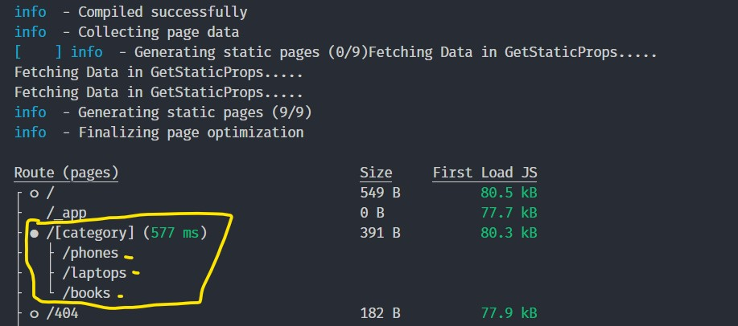

# Getting Started

- [Getting Started](#getting-started)
  - [Routing](#routing)
    - [Create route and navigate between pages](#create-route-and-navigate-between-pages)
    - [create dynamic routes](#create-dynamic-routes)
  - [Overriding the App Component](#overriding-the-app-component)
  - [Overriding the Document Component](#overriding-the-document-component)
  - [Custom Layouts](#custom-layouts)
    - [Single Shared Layout](#single-shared-layout)
    - [Per-Page Layouts](#per-page-layouts)
  - [Metadata and Image](#metadata-and-image)
    - [Seo Metadata](#seo-metadata)
    - [Image Optimization](#image-optimization)
      - [src is a url](#src-is-a-url)
  - [Understanding the different rendering methods in next.js](#understanding-the-different-rendering-methods-in-nextjs)
    - [SSG ans ISR](#ssg-ans-isr)
      - [Incremental Static Regeneration](#incremental-static-regeneration)

## Routing

### Create route and navigate between pages

Navigating between Home and About Pages:

`pages/index.tsx`

```tsx
import Link from 'next/link';

export default function Home() {
 return (
  <div>
   <h1 className='text-4xl font-bold'>Welcome to Home Page!</h1>;
   <Link href={'/about'}>
    <span className='text-blue-500 underline cursor-pointer'>About</span>
   </Link>
  </div>
 );
}
```

`pages\about.tsx`

```tsx
import Link from 'next/link';

const About = () => {
 return (
  <div>
   <h1 className=' text-4xl'>About</h1>
   <Link href='/'>
    <span className='text-blue-500 underline cursor-pointer'>Home</span>
   </Link>
  </div>
 );
};

export default About;
```

### create dynamic routes

Defining routes by using predefined paths is not always enough for complex applications. In Next.js you can add brackets to a page (`[param]`) to create a dynamic route (a.k.a. url slugs, pretty urls, and others).

Creating a dynamic route like: `post/[any-post-id]/[any-comment-id]`

`pages\post\[pid]\[comment].tsx`

```tsx
import { useRouter } from 'next/router';
export default function Comment() {
 const router = useRouter();

 return (
  <>
   <p>Comment Details: {JSON.stringify(router.query, null, 4)}</p>
  </>
 );
}
```

Now if we visit `http://localhost:3000/post/1/1` , we will see the following result:

```txt
Comment Details: { "pid": "1", "comment": "1" }
```

## Overriding the App Component

- [https://nextjs.org/docs/advanced-features/custom-app](https://nextjs.org/docs/advanced-features/custom-app)

`pages\_app.tsx`

```tsx
import '../styles/globals.css';
import type { AppProps } from 'next/app';

function MyApp({ Component, pageProps }: AppProps) {
 console.log(pageProps);

 return <Component {...pageProps} />;
}

export default MyApp;
```

`pageProps` is an object with the initial props that were preloaded for your page by one of our data fetching methods, otherwise it's an empty object.

So, we can pass `pageProps` to any component we want. For example, we can pass a `title` prop to the component:`pages\index.tsx`

`pages\_app.tsx`:

```tsx
import '../styles/globals.css';
import type { AppProps } from 'next/app';

function MyApp({ Component, pageProps }: AppProps) {
 (pageProps as any).title = 'Injected by MyApp';

 return <Component {...pageProps} />;
}

export default MyApp;
```

`pages\index.tsx`:

```tsx
export default function Home({ title }: { title: string }) {
 return <div>{title}</div>;
}
```

## Overriding the Document Component

- [https://nextjs.org/docs/advanced-features/custom-document](https://nextjs.org/docs/advanced-features/custom-document)

We may need to change the default HTML document that Next.js renders. For example, to add a custom `<html>` ; add lang="en" to the `<html>` tag, or `<body>` tag, or to inject additional HTML into the `<head>`.

`pages\_document.tsx`

```tsx
import { Html, Head, Main, NextScript } from 'next/document';

export default function Document() {
 return (
  <Html lang='en'>
   <Head />
   <body>
    <Main />
    <NextScript />
   </body>
  </Html>
 );
}
```

## Custom Layouts

### Single Shared Layout

`components\layout\index.tsx`:

```tsx
import Footer from './Footer';
import Header from './Header';
type Props = {
 children: React.ReactNode;
};

const Layout = ({ children }: Props) => {
 return (
  <div className='flex h-screen flex-col justify-between'>
   <Header />
   <main>{children}</main>
   <Footer />
  </div>
 );
};

export default Layout;

```

`components\layout\Header.tsx`:

```tsx
const Header = () => {
 return <div className='flex w-screen h-20 bg-gray-400'></div>;
};

export default Header;
```

`components\layout\Footer.tsx`:

```tsx
const Footer = () => {
 return <div className='flex w-screen h-40 border-t-2'></div>;
};

export default Footer;
```

### Per-Page Layouts

`pages\_app.tsx`:

```typescript
import type { AppProps } from 'next/app';
import { NextPage } from 'next';
import { ReactElement, ReactNode } from 'react';

type NextPageWithLayout = NextPage & {
 getLayout?: (Page: ReactElement) => ReactNode;
};

type AppPropsWithLayout = AppProps & {
 Component: NextPageWithLayout;
};

function MyApp({ Component, pageProps }: AppPropsWithLayout) {
 // wrap the Component with the custom layout
 const getLayout = Component.getLayout ?? ((Page) => Page);
 return getLayout(<Component {...pageProps} />);
}

export default MyApp;
```

`pages\index.tsx`:

```tsx
const Home = () => {
 return (
  <div>
   <h1 className='text-4xl font-bold'>Welcome to Home Page!</h1>;
   <Link href={'/about'}>
    <span className='text-blue-500 underline cursor-pointer'>About</span>
   </Link>
  </div>
 );
};

Home.getLayout = (Page: ReactElement) => {
 return <Layout>{Page}</Layout>;
};

export default Home;
```

## Metadata and Image

### Seo Metadata

More on seo:

- [https://github.com/garmeeh/next-seo](https://github.com/garmeeh/next-seo)
- [https://delba.dev/blog/next-blog-generate-og-image](https://delba.dev/blog/next-blog-generate-og-image)
- [https://www.netlify.com/blog/2020/05/08/improve-your-seo-and-social-sharing-cards-with-next.js/](https://www.netlify.com/blog/2020/05/08/improve-your-seo-and-social-sharing-cards-with-next.js/)
- [https://www.jimraptis.com/blog/seo-component-for-next-js-react](https://www.jimraptis.com/blog/seo-component-for-next-js-react)

### Image Optimization

#### src is a url

Next.js requires that the url is from the same domain or a subdomain of the current domain. If the url is external, you must add the domain to the `images.domains` array in `next.config.js`:


```tsx
<Image
  src='https://images.unsplash.com/photo-1499750310107-5fef28a66643?ixlib=rb-1.2.1&ixid=MnwxMjA3fDB8MHxwaG90by1wYWdlfHx8fGVufDB8fHx8&auto=format&fit=crop&w=870&q=80'
  alt={title}
  width={300}
  height={150}
  objectFit='cover'
/>
```


```js
/** @type {import('next').NextConfig} */
const nextConfig = {
	reactStrictMode: true,
	swcMinify: true,
	images: {
		domains: ['images.unsplash.com']
	}
};

module.exports = nextConfig;
```

## Understanding the different rendering methods in next.js

Static Site Generation (SSG):

<div align="center">

</div>

Server-Side Rendering (SSR):

<div align="center">

</div>

Incremental Static Regeneration (ISR):

<div align="center">

</div>

### SSG ans ISR

`pages\index.tsx`:

```tsx
const Home = () => {
 const categories = ['phones', 'laptops', 'books'];
 return (
  <div>
   <h1 className='text-4xl font-bold'>Welcome to Home Page!</h1>;
   <div className='flex flex-col'>
    {categories.map((category) => (
     <Link href={`/${category}`}>
      <span className='text-blue-500 underline cursor-pointer'>{category}</span>
     </Link>
    ))}
   </div>
  </div>
 );
};
```

`pages\[category].tsx`:

```tsx
import { GetStaticPaths, GetStaticProps } from 'next';
import Link from 'next/link';
import React from 'react';
type Props = {
	category: string;
};

const Category = ({ category }: Props) => {
	return (
		<div>
			<h1 className=' text-4xl'>{category}</h1>
			<Link href='/'>
				<span className='text-blue-500 underline cursor-pointer'>Home</span>
			</Link>
		</div>
	);
};

// Handle dynamic routes statically
export const getStaticPaths: GetStaticPaths = () => {
	// which pages to pre-render
	const routes = ['phones', 'laptops', 'books'];
	return {
		paths: routes.map((category) => ({ params: { category } })),
		fallback: true
	};
};

// tells how each route should be rendered
//  and what data should be passed to the page
export const getStaticProps: GetStaticProps<Props> = (context) => {
	const category = context.params?.['category'] as string;
	if (!category) {
		return {
			notFound: true
		};
	}
	console.log('Fetching Data in GetStaticProps.....');

	return {
		props: {
			category
		}
	};
};
export default Category;

```

`yarn build` generate these pages at build time:

<div align="center">

</div>


#### Incremental Static Regeneration

To use ISR, add the `revalidate` prop to `getStaticProps`:


```tsx
export const getStaticProps: GetStaticProps<Props> = (context) => {
	const category = context.params?.['category'] as string;
	if (!category) {
		return {
			notFound: true
		};
	}
	console.log('Fetching Data in GetStaticProps.....');

	return {
		props: {
			category
		},
		revalidate: 5
	};
};
export default Category;
```
