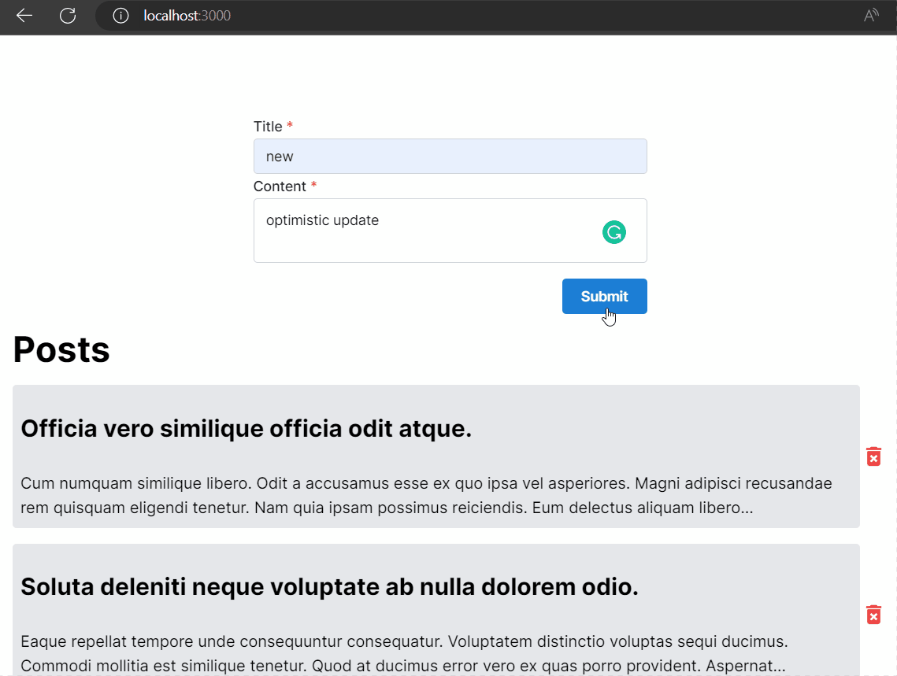

# SWR

Inside your React project directory, run the following:

```bash
yarn add swr
```

- [https://swr.vercel.app/](https://swr.vercel.app/)
- [https://swr.vercel.app/docs/getting-started](https://swr.vercel.app/docs/getting-started)

Content:

- [SWR](#swr)
  - [Data Fetching in React](#data-fetching-in-react)
    - [Global Configuration](#global-configuration)
  - [Mutation](#mutation)
    - [Optimistic UI](#optimistic-ui)
      - [Bound Mutate](#bound-mutate)
  - [Pagination](#pagination)
  - [SSR - Pre-rendering with Default Data](#ssr---pre-rendering-with-default-data)

## Data Fetching in React

Fetcher:

```typescript
// using axios
import axios from 'axios';
export const fetcher = (url: string) => axios.get(url).then((res) => res.data);

// or using fetch
export const fetcher = (...args: Parameters<typeof fetch>) =>
 fetch(...args).then((res) => res.json());
```

```tsx
import useSWR from 'swr';
export default function Home() {
 const { data: posts, error } = useSWR<Post[]>('api/posts', fetcher);
 if (error) return <div>failed to load</div>
 if (!posts) return <div>loading...</div>

 return <>...</>;
}
```

Make It Reusable:

When building a web app, you might need to reuse the data in many places of the UI. It is incredibly easy to create reusable data hooks on top of SWR:

```tsx
function useUser (id) {
  const { data, error } = useSWR(`/api/user/${id}`, fetcher)
  return {
    user: data,
    isLoading: !error && !data,
    isError: error
  }
}
```

### Global Configuration

- [https://swr.vercel.app/docs/global-configuration](https://swr.vercel.app/docs/global-configuration)

In this example, all SWR hooks will use the same fetcher provided to load JSON data, and refresh every 3 seconds by default:

```tsx
import useSWR, { SWRConfig } from 'swr'
export const fetcher = (...args: Parameters<typeof fetch>) =>
 fetch(...args).then((res) => res.json());

function Dashboard () {
  const { data: events } = useSWR('/api/events')
  const { data: projects } = useSWR('/api/projects')
  const { data: user } = useSWR('/api/user', { refreshInterval: 0 }) // override

  // ...
}

function App () {
  return (
    <SWRConfig
      value={{
        refreshInterval: 3000,
        fetcher
      }}
    >
      <Dashboard />
    </SWRConfig>
  )
}
```

## Mutation

- [https://swr.vercel.app/docs/mutation](https://swr.vercel.app/docs/mutation)

```tsx
import { Post } from '@prisma/client';
import { mutate } from 'swr';

export default function Home() {
 const form = useForm({
  initialValues: {
   title: '',
   content: ''
  },
  validate: {
   title: (value) => (value.length > 0 ? null : 'Title is required'),
   content: (value) => (value.length > 0 ? null : 'Content is required')
  }
 });


 const { data: posts, error } = useSWR<Post[]>('api/posts');
 if (error) return <div>failed to load</div>;

// Mutation: createPost
 const addPost = async (values: typeof form.values) => {
  await axios.post('api/posts', values);
  // update the local data `posts` immediately and revalidate (refresh) the data
  mutate('api/posts');
 };


 return (<form onSubmit={form.onSubmit((values) => addPost(values))}>
      ....
     </form>);
}
```

### Optimistic UI

<div align="center">

</div>

```tsx
import { Post } from '@prisma/client';
import { mutate } from 'swr';

type OptimisticPost = Post & { optimistic?: boolean }; // add a new field `optimistic` ; can be used to style the post denoting it is not yet persisted

export default function Home() {

 const form = useForm({
  initialValues: {
   title: '',
   content: ''
  },
  validate: {
   title: (value) => (value.length > 0 ? null : 'Title is required'),
   content: (value) => (value.length > 0 ? null : 'Content is required')
  }
 });

 const { data: posts, error } = useSWR<OptimisticPost[]>('api/posts');
 if (error) return <div>failed to load</div>;

 const addPost = async (values: typeof form.values) => {
  // Optimistic update
  const OPTIMISTIC_POST = {
   id: Math.random(),
   title: values.title,
   content: values.content,
   createdAt: new Date().toISOString(),
   updatedAt: new Date().toISOString(),
   comments: [],
   optimistic: true
  };
  mutate('api/posts', (posts: OptimisticPost[]) => [OPTIMISTIC_POST, ...posts], false);
  await axios.post('api/posts', values);
  // Replace the optimistic post with the real one
  mutate('api/posts');
 };

 return (
    <>
      <form onSubmit={form.onSubmit((values) => addPost(values))}>
      ....
     </form>
      <ul>
        {posts?.map((post) => (
        <li key={post.id} style={post.optimistic ? { opacity: 0.5 } : {}}>
          <h3>{post.title}</h3>
          <p>{post.content}</p>
        </li>
        ))}
    </>
     );
}
```

#### Bound Mutate

The SWR object returned by `useSWR` also contains a `mutate()` function that is pre-bound to the SWR's `key`.

It is functionally equivalent to the global `mutate` function but does not require the key parameter.

```tsx
import { Post } from '@prisma/client';
type OptimisticPost = Post & { optimistic?: boolean };

export default function Home() {
 const { data: posts, error, mutate } = useSWR<OptimisticPost[]>('api/posts');
 if (error) return <div>failed to load</div>;

 const addPost = async (values: typeof form.values) => {
  // Optimistic update
  const OPTIMISTIC_POST: OptimisticPost = {
   id: String(Math.random()),
   title: values.title,
   content: values.content,
   createdAt: new Date(),
   updatedAt: new Date(),
   optimistic: true
  };
  mutate([OPTIMISTIC_POST, ...(posts || [])], false);
  // mutate([OPTIMISTIC_POST, ...(posts as OptimisticPost[])], false);
  await axios.post('api/posts', values);
  mutate();
 };
}
```

## Pagination

- [https://swr.vercel.app/docs/pagination](https://swr.vercel.app/docs/pagination)

Backend: `pages\api\posts\index.ts`

```typescript
handler.get(async (req: NextApiRequest, res: NextApiResponse) => {
 const page = Number(req.query.page) || 1;
 const limit = Number(req.query.limit) || 3;
 const skip = (page - 1) * limit;

 const [posts, count] = await prisma.$transaction([
  prisma.post.findMany({
   skip,
   take: limit,
   orderBy: {
    updatedAt: 'desc'
   }
  }),
  prisma.post.count()
 ]);

 const totalPages = Math.ceil(count / limit);
 const hasMore = page < totalPages;
 const nextPage = hasMore ? page + 1 : null;
 const prevPage = page > 1 ? page - 1 : null;
 const links = {
  nextPage,
  prevPage,
  hasMore,
  totalPages
 };

 res.json({ posts, links });
});
```

Frontend: `pages\index.tsx`

```tsx
import { Post } from '@prisma/client';
import { useState } from 'react';
type OptimisticPost = Post & { optimistic?: boolean };

type PostResponse = {
 posts: OptimisticPost[];
 links: {
  nextPage: string | null;
  prevPage: string | null;
  hasMore: boolean;
  totalPages: number;
 };
};

export default function Home() {
 const [activePage, setPage] = useState(1);
 const { data, error, mutate } = useSWR<PostResponse>(`/api/posts?page=${activePage}`);

  return (
    <div>
     {!data?.posts && (
      <div >
       Loading posts...
      </div>
     )}
     {data?.posts?.map((post) => (
      <div>
          ....
      </div>
     ))}
     <Pagination
     page={activePage}
     onChange={setPage}
     total={data?.links.totalPages as number}
     withEdges
    />
    </div>)
}
```

## SSR - Pre-rendering with Default Data

- [https://swr.vercel.app/docs/with-nextjs](https://swr.vercel.app/docs/with-nextjs)
- [https://swr.vercel.app/docs/with-nextjs#pre-rendering-with-default-data](https://swr.vercel.app/docs/with-nextjs#pre-rendering-with-default-data)

Together with `SWR`, you can pre-render the page for `SEO`, and also have features such as `caching`, `revalidation`, `focus tracking`, `refetching on interval` on the **`client side`**.

You can use the `fallback` option of `SWRConfig` to pass the pre-fetched data as the initial value of all SWR hooks. For example with `getStaticProps`:

`pages\_app.tsx`

```tsx
import axios from 'axios';
axios.defaults.baseURL = 'http://localhost:3000';
// axios fetcher
const fetcher = (url: string) => axios.get(url).then((res) => res.data);

function MyApp(props: AppProps) {
 const { Component, pageProps } = props;
 return (
  <>
    <SWRConfig
      value={{
       fetcher,
       refreshInterval: 10000,
       revalidateOnFocus: true,
       fallback: pageProps.fallback // every SWR hook will receive this as `initial data`
      }}>
    <Component {...pageProps} />
   </SWRConfig>
  </>
 );
}
export default MyApp;
```

`pages\index.tsx`

```tsx
import { GetServerSidePropsContext } from 'next';
type OptimisticPost = Post & { optimistic?: boolean };

type PostResponse = {
 posts: OptimisticPost[];
 links: {
  nextPage: string | null;
  prevPage: string | null;
  hasMore: boolean;
  totalPages: number;
 };
};

export default function Home() {
 const [activePage, setPage] = useState(1);
 const { data, error, mutate } = useSWR<PostResponse>(`/api/posts?page=${activePage}`);

  return (
    <div>
     {!data?.posts && (
      <div >
       Loading posts...
      </div>
     )}
     {data?.posts?.map((post) => (
      <div>
          ....
      </div>
     ))}
     <Pagination
     page={activePage}
     onChange={setPage}
     total={data?.links.totalPages as number}
     withEdges
    />
    </div>
  )
}


export async function getServerSideProps(context: GetServerSidePropsContext) {
 const data = await fetch('http://localhost:3000/api/posts').then((res) => res.json());
 return {
  props: {
   fallback: {
    '/api/posts?page=1': JSON.parse(JSON.stringify(data))
   }
  }
 };
}
```