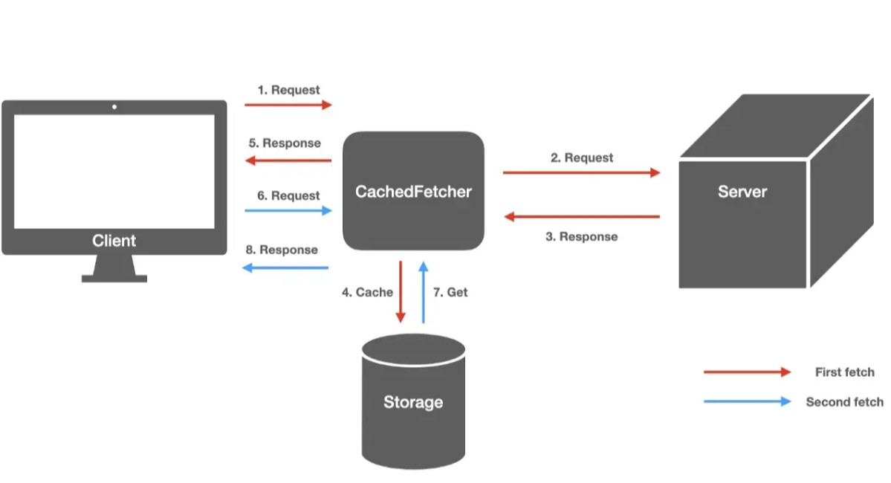

# Introduction to data fetching solutions in React

- [Introduction to data fetching solutions in React](#introduction-to-data-fetching-solutions-in-react)
  - [Data Fetching Problem in React/Nextjs](#data-fetching-problem-in-reactnextjs)
  - [Problem of Caching](#problem-of-caching)
    - [With native way of fetching data](#with-native-way-of-fetching-data)
    - [With SWR](#with-swr)
  - [Optimistic Update](#optimistic-update)

## Data Fetching Problem in React/Nextjs

Let's we are on `Home` page and want to go to the `Product Lists` page. When we go the the `Product List` page, react will fetch the data from the server and render the page. Then if we go to the `Product Detail` page, react will fetch the details of the product from the server and render the page. *But if we go back to the `Product List` page, react will fetch the product lists again from the server*. This is not good for the performance of the app. We don't want to fetch the data again and again.

To solve this problem, we can use the `React-Query`, `SWR`, `RTK-Query` or `Apollo Client` libraries.

[SWR](https://swr.vercel.app/), for example, first returns the data from **cache** (stale/not fresh), then sends the request (revalidate) to the server, and finally comes with the up-to-date data again. Therefore, when we visit the `Product List` page, react will fetch the data and store it in the cache. Then on every time we visit the `Product List` page, react will used the coached data. This is good for the performance of the app.

## Problem of Caching

### With native way of fetching data

`pages/index.tsx`

```tsx
export default function Home() {
 const [posts, setPosts] = useState<Post[] | null>(null);
 const getPosts = async () => {
  const { data } = await axios('api/posts');
  setPosts(data);
 };

 useEffect(() => {
  getPosts();
 }, []);

 return <>...</>;
}
```

`pages/posts/[id].tsx`

```tsx
export default function PostDetail() {
 const router = useRouter();
 const { id } = router.query;
 const [comments, setComments] = useState<Comment[]>();
 const [post, setPost] = useState<Post>();
 const getPost = async () => {
  const { data } = await axios(`/api/posts/${id}`);
  setPost(data);
 };
 const getComments = async () => {
  const { data } = await axios(`/api/comments/${id}`);
  setComments(data);
 };

 useEffect(() => {
  const getPostAndComments = async () => {
   await getPost();
   await getComments();
  };
  getPostAndComments();
 }, [id]);

 return <>...</>;
}
```

Demo:

<div align="center">

</div>

**We can see that we fetch the same data again and again in page revisit.**

So we can say data is not cached in the native way of fetching data.

### With SWR

`pages/index.tsx`

```tsx
import useSWR from 'swr';
export const fetcher = (...args: Parameters<typeof fetch>) =>
 fetch(...args).then((res) => res.json());

export default function Home() {
 // const [posts, setPosts] = useState<Post[] | null>(null);
 // const getPosts = async () => {
 //  const { data } = await axios('api/posts');
 //  console.log(data);
 //  setPosts(data);
 // };
 // useEffect(() => {
 //  getPosts();
 // }, []);

 const { data: posts, error } = useSWR<Post[]>('api/posts', fetcher);

 if (error) return <div>failed to load</div>;
 if (!posts) return <div>loading...</div>;

 return <>...</>;
}
```

`pages/posts/[id].tsx`

```tsx
import useSWR from 'swr';
import axios from 'axios';
// const fetcher = (url: string) => axios.get(url).then((res) => res.data);
export const fetcher = (...args: Parameters<typeof fetch>) =>
 fetch(...args).then((res) => res.json());
const PostDetail = () => {
 const router = useRouter();
 const { id } = router.query;
 // const [comments, setComments] = useState<Comment[]>();
 // const [post, setPost] = useState<Post>();
 // const getPost = async () => {
 //  const { data } = await axios(`/api/posts/${id}`);
 //  setPost(data);
 // };
 // const getComments = async () => {
 //  const { data } = await axios(`/api/comments/${id}`);
 //  setComments(data);
 // };

 // useEffect(() => {
 //  const getPostAndComments = async () => {
 //   await getPost();
 //   await getComments();
 //  };
 //  getPostAndComments();
 // }, [id]);

 const { data: comments, error: commentsError } = useSWR<Comment[]>(
  `/api/comments/${id}`,
  fetcher
 );
 if (commentsError) return <div>failed to load</div>;
 const { data: post, error: postError } = useSWR<Post>(`/api/posts/${id}`, fetcher);
 if (postError) return <div>failed to load</div>;

 if (!comments || !post) return <div>loading...</div>;

 return <>...</>;

};
```

Demo:

<div align="center">

</div>

Now, we can see that we don't fetch the same data again and again in page revisit as data is cached.

<div align="center">

</div>

## Optimistic Update

<div align="center">

</div>

```tsx
	const { data: posts, error, mutate } = useSWR<OptimisticPost[]>('api/posts');
	if (error) return <div>failed to load</div>;
	const addPost = async (values: typeof form.values) => {
		// Optimistic update
		const OPTIMISTIC_POST: OptimisticPost = {
			id: String(Math.random()),
			title: values.title,
			content: values.content,
			createdAt: new Date(),
			updatedAt: new Date(),
			optimistic: true
		};
		mutate([OPTIMISTIC_POST, ...(posts as OptimisticPost[])], false);
		// Send request to server
		await axios.post('api/posts', values);
		// revert optimistic update and revalidate with server data
		mutate();
	};
```

