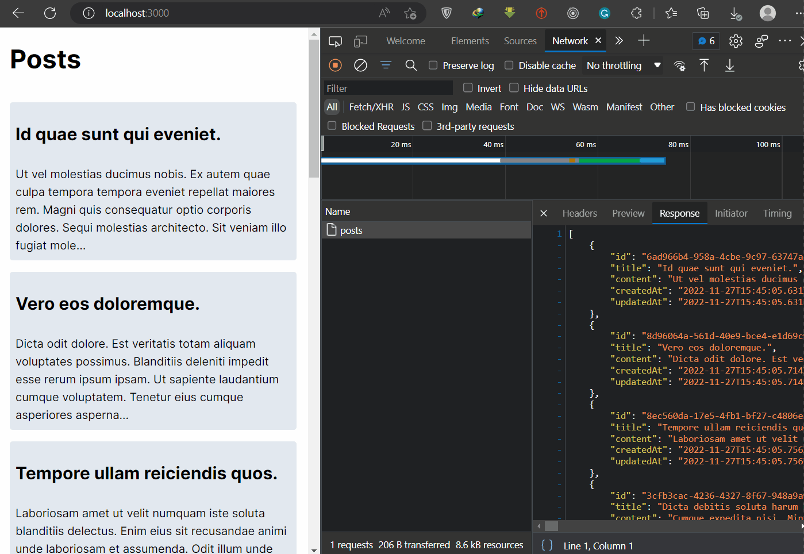

# Data Fetching Problem in React/Nextjs

Let's we are on `Home` page and want to go to the `Product Lists` page. When we go the the `Product List` page, react will fetch the data from the server and render the page. Then if we go to the `Product Detail` page, react will fetch the details of the product from the server and render the page. *But if we go back to the `Product List` page, react will fetch the product lists again from the server*. This is not good for the performance of the app. We don't want to fetch the data again and again.

To solve this problem, we can use the `React-Query`, `SWR`, `RTK-Query` or `Apollo Client` libraries.

[SWR](https://swr.vercel.app/), for example, first returns the data from **cache** (stale/not fresh), then sends the request (revalidate) to the server, and finally comes with the up-to-date data again. Therefore, when we visit the `Product List` page, react will fetch the data and store it in the cache. Then on every time we visit the `Product List` page, react will used the coached data. This is good for the performance of the app.

## No-Cache in native fetch

`pages/index.tsx`

```tsx
export default function Home() {
 const [posts, setPosts] = useState<Post[] | null>(null);
 const getPosts = async () => {
  const { data } = await axios('api/posts');
  setPosts(data);
 };

 useEffect(() => {
  getPosts();
 }, []);

 return <>...</>;
}
```

`pages/posts/[id].tsx`

```tsx
export default function PostDetail() {
 const router = useRouter();
 const { id } = router.query;
 const [comments, setComments] = useState<Comment[]>();
 const [post, setPost] = useState<Post>();
 const getPost = async () => {
  const { data } = await axios(`/api/posts/${id}`);
  setPost(data);
 };
 const getComments = async () => {
  const { data } = await axios(`/api/comments/${id}`);
  setComments(data);
 };

 useEffect(() => {
  const getPostAndComments = async () => {
   await getPost();
   await getComments();
  };
  getPostAndComments();
 }, [id]);

 return <>...</>;
}
```


Demo:

<div align="center">

</div>

We can see that we fetch the data again and again.