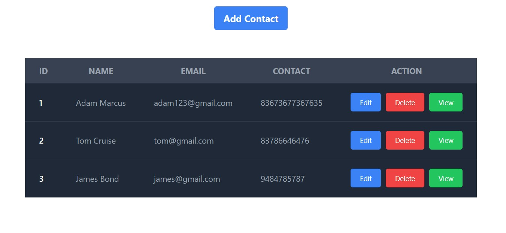

# React-Router Based CRUD Template

This is a template for a React-Router based CRUD application. It is based on the [React-Router](https://reacttraining.com/react-router/web/guides/quick-start) library.

<div align="center">

</div>

## Dependencies

```bash
yarn add react-router-dom react-hot-toast
```