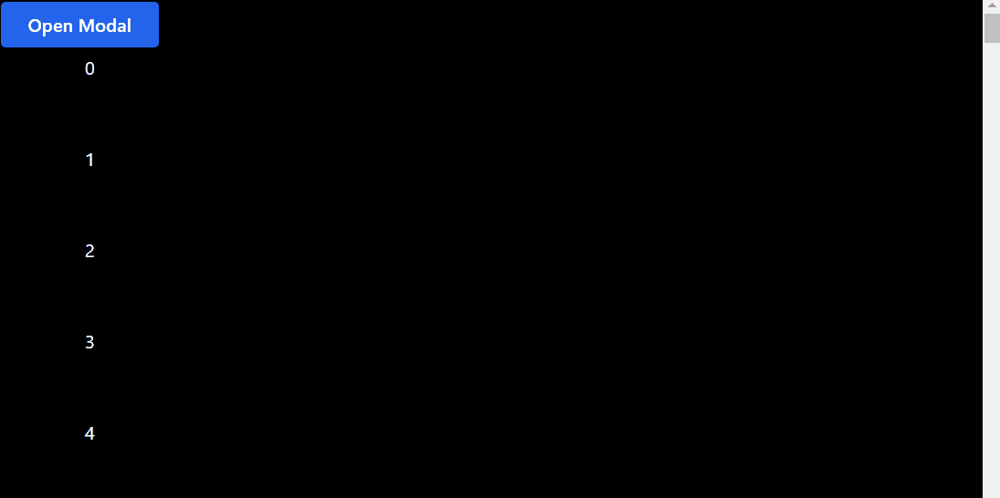

# Modal Animation

- AnimatePresence
- React Portal from from `@reach/portal` | [Learn React Portal In 12 Minutes By Building A Modal](https://www.youtube.com/watch?v=LyLa7dU5tp8&t)
- `useOnClickOutside` from `usehooks-ts`